# Slicing mit ideaMaker

Nachdem du z.&nbsp;B. mit Tinkercad ein 3D-Objekt erstellt hast, kannst du es als STL-Datei exportieren, indem du rechts oben auf den Knopf „Exportieren“ klickst und dann „.STL“ auswählst.

{}
- 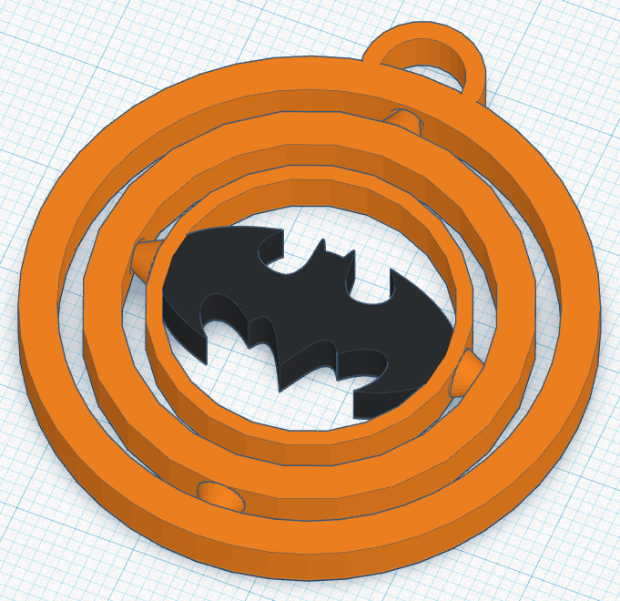
- 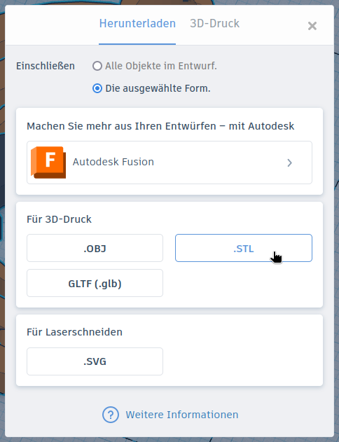
{}

Damit dieses Objekt ausgedruckt werden kann, muss es zuerst in die Sprache des 3D-Druckers übersetzt werden. Es muss also in eine Datei umgewandelt werden, die später die Bewegung des Druckkopfs beschreibt. Diese Übersetzung übernimmt der sogenannte **Slicer** (von englisch *to slice* = schneiden).

Es gibt verschiedene Slicer. Manche kosten Geld, es gibt aber auch kostenlose Open-Source-Programme. Manchmal muss für einen bestimmten 3D-Drucker auch ein vorgegebener Slicer verwendet werden. Wir verwenden in dieser Anleitung den Slicer **ideaMaker** von der Firma RAISE3D. Er kann kostenlos für verschiedene Betriebssysteme heruntergeladen werden.

## Start des Programms

Starte ideaMaker indem du auf die Windows-Taste (mit dem Symbol ⊞) drückst, das Wort „ideaMaker“ (ohne Anführungszeichen) eintippst und die Enter-Taste drückst.

Beim Start wird geprüft, ob es eine neue Version des Programms gibt. Das Fenster kannst du per Klick auf „Erinnern Sie mich später“ schließen.

### Erster Start

Beim ersten Start fragt das Programm, ob man eine helle oder dunkle Oberfläche benutzen möchte. Suche dir aus, was dir besser gefällt.

Danach kannst du den Standarddrucker auswählen. Wir verwenden den **RAISE3D E2**. Wähle ihn aus und klicke auf „Fortfahren“. Die Extruderzahl (Anzahl der Druckköpfe) beträgt **2**. Außerdem soll das **Heizbett** benutzt werden. Klicke dann wieder auf „Fortfahren“. Die Einstellungen zum Filament können so bleiben.

{}
- 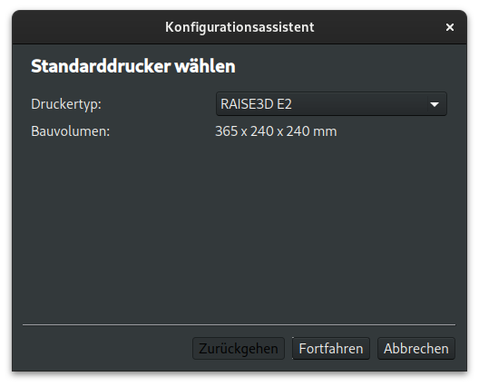
- 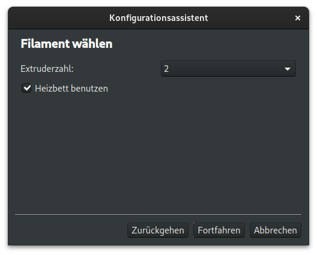
{}

## Hauptfenster

Nach dem Start zeigt ideaMaker den Druckbereich des 3D-Druckers an.

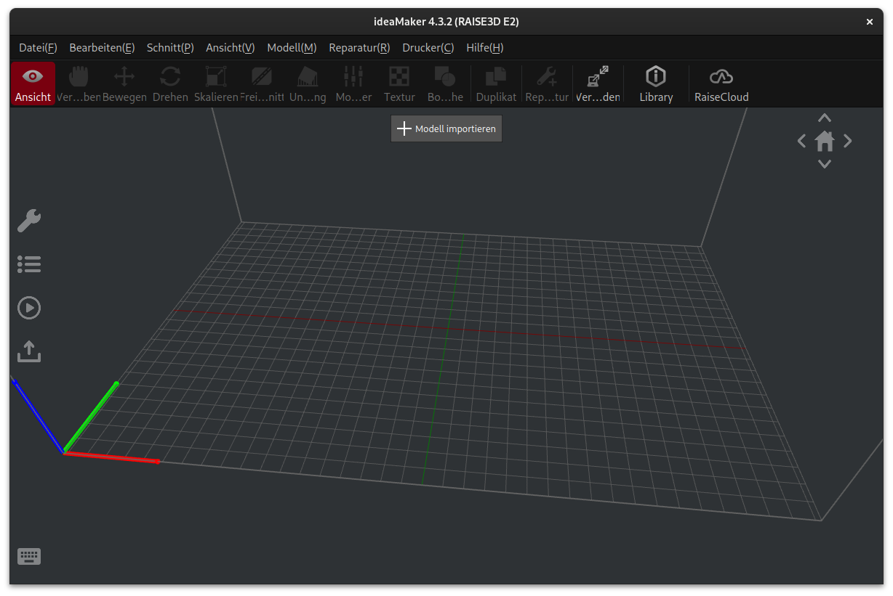

Die Ansicht kann:
- mit gedrückter **linker Maustaste** gedreht,
- mit dem **Mausrad** vergrößert und verkleinert und
- mit gedrücktem **Mausrad** bewegt werden.

## Import von 3D-Objekten

Klicke oben in der Mitte auf **Modell importieren** und wähle auf der Festplatte eine STL-Datei aus, um das 3D-Objekt zu importieren.

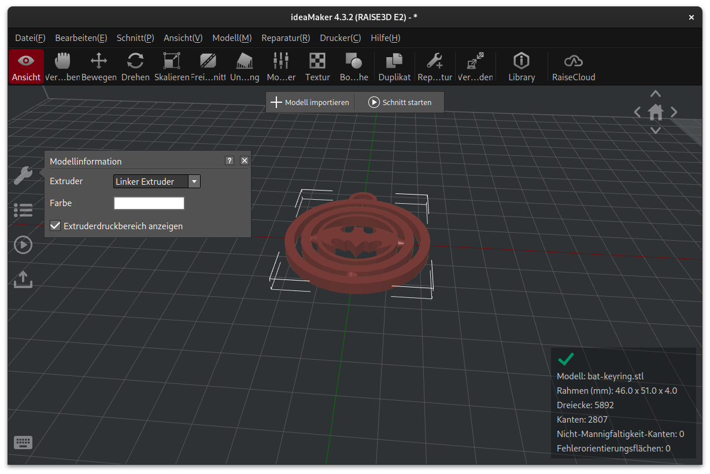

Du kannst auf diese Weise beliebig viele 3D-Objekte importieren.

## Festlegung des Extruders

Unsere 3D-Drucker besitzen zwei Extruder (Druckköpfe) und können mit zwei verschiedenen Filamenten drucken. Nach dem Laden solltest du festlegen, ob du das Objekt mit dem linken oder dem rechten Extruder drucken möchtest. Je nachdem, welches Filament in den Drucker links bzw. rechts eingelegt ist, entscheidest du dich damit auch für eine Farbe.

Klicke dazu links beim Symbol des Schraubenschlüssels beim Punkt „Extruder“ auf **Linker Extruder** oder **Rechter Extruder**. Hier kann auch die Farbe des Objekts eingestellt werden. Das ändert aber nur die Darstellung im Programm! Die Farbe des fertigen Objekts entscheidet sich nur nach dem eingelegten Filament.

Alternativ kannst du auch mit der rechten Maustaste auf ein Objekt klicken und dort den Extruder auswählen.

## Bewegen, Drehen und Skalieren von Objekten

Wenn du ein Objekt per Mausklick auswählst, kannst du es auf dem Druckbett bewegen, drehen oder seine Größe ändern (skalieren). Klicke dazu in der oberen Symbolleiste auf das entsprechende Symbol. Je nach Auswahl werden am Objekt Balken oder Kreise angezeigt, die du mit der linken Maustaste anklicken kannst, um das Objekt zu verändern. Alternativ kannst du links beim Schraubenschlüssel exakte Angaben machen, z.&nbsp;B. um das Objekt auf bestimmte Abmessungen zu vergrößern oder zu verkleinern. Denke beim Skalieren daran, die **Gleichmäßige Skalierung** auszuwählen, damit das Objekt nicht verzerrt wird.

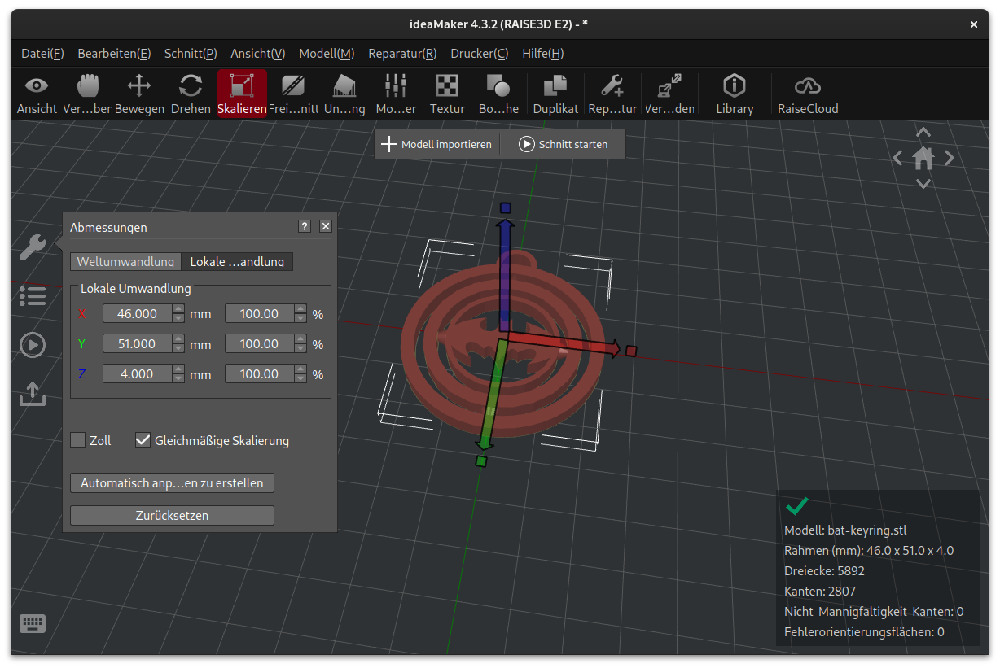

## Objekt auf Fläche legen

Manchmal kommt es vor, dass ein Objekt gedreht werden muss, damit es guten Kontakt zum Druckbett hat und z.&nbsp;B. mit weniger Überhängen gedruckt werden kann. Dafür gibt es die spezielle Funktion „Flach liegen“.

Wähle dazu das Objekt aus und klicke im oberen Hauptmenü auf **Modell(M)** → **Flach liegen**. Daraufhin werden die Dreiecke angezeigt, aus denen das Objekt besteht. Wähle nun per Mausklick ein Dreieck aus, das flach auf dem Druckbett aufliegen soll. Klicke danach links beim Schraubenschlüssel auf „Anwenden“ um das Objekt zu drehen.

## Einfacher Schnitt

Es gibt zwei Möglichkeiten, einen Schnitt zu starten. Die einfache Variante ist, oben in der Mitte auf **Schnitt starten** zu klicken. Es öffnet sich ein Fenster, wo die Druckqualität eingestellt werden kann.

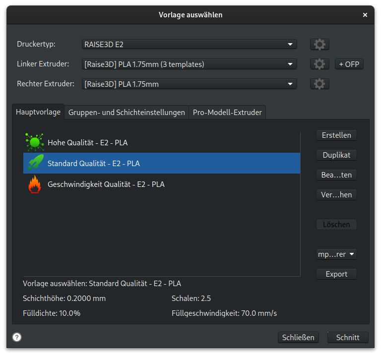

Hier kannst du zwischen drei Einstellungen wählen, je nachdem, ob die Druckzeit oder die Qualität für dich wichtiger ist. Normalerweise sollte die Einstellung „Standard Qualität“ für die meisten Objekte ausreichen. Wähle sie aus und klicke auf **Schnitt**.

Im nächsten Fenster werden Druckzeit, Filamentmenge und Preis abgeschätzt.

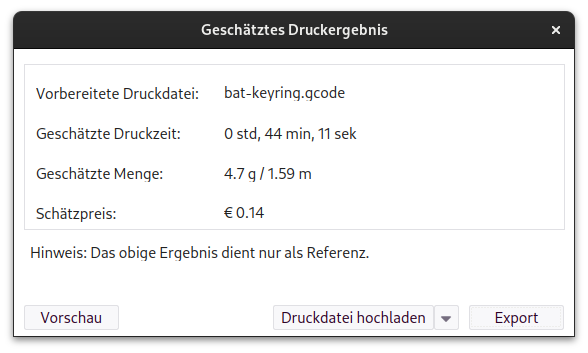

Klicke auf „Vorschau“ um das Ergebnis zu betrachten.

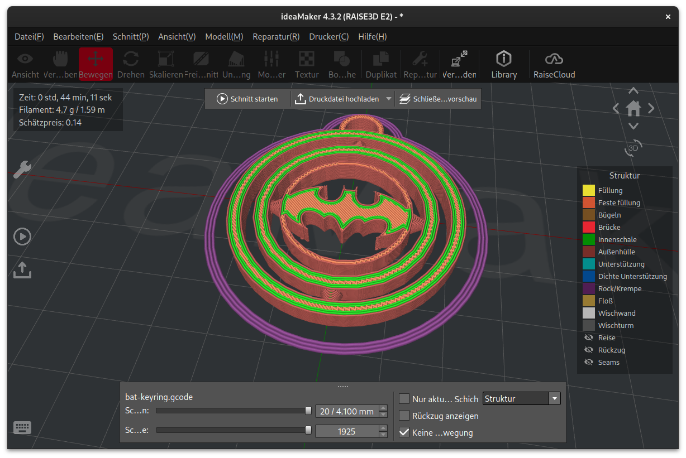

Über die beiden Schieberegler unten kannst du dir die einzelnen Drucklagen und das Innere des Objekts anschauen.

## Export der Schnittdatei

Bist du mit dem Ergebnis zufrieden, kannst du die Schnittdatei exportieren. Klicke dazu oben in der Mitte auf den **kleinen Pfeil** neben „Druckdatei hochladen“ und wähle „Auf lokales … exportieren“. Klicke danach auf den mittleren Kopf um das Ergebnis abzuspeichern.

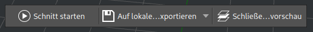

Beim Export werden zwei Dateien erzeugt: Eine Datei mit der Endung **gcode** und eine Datei mit der Endung **data**. Die gcode-Datei enthält die Anweisungen für den Drucker, während die data-Datei weniger wichtige Informationen (z.&nbsp;B. ein Vorschaubild) enthält, die vor dem Druck am 3D-Drucker angezeigt werden.

## Angepasster Schnitt

Der Schnitt kann auch über das Play-Symbol am linken Rand gestartet werden.

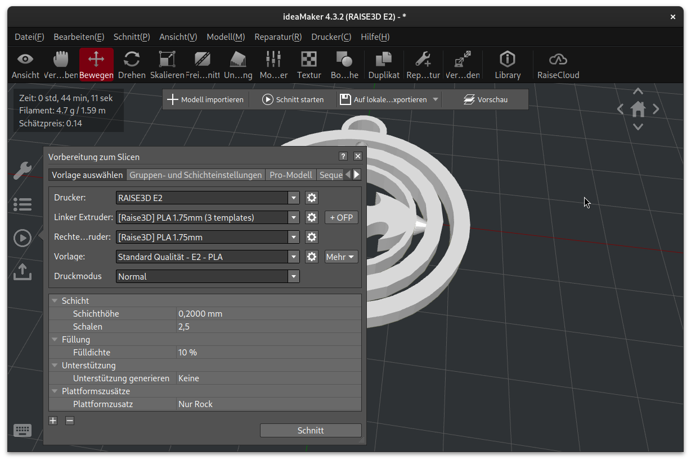

Dort können weitere Einstellungen vorgenommen werden:

{}
1. ### Fülldichte
   Die **Fülldichte** legt fest, wie viel Material im Inneren des Objekts verwendet wird. Je höher dieser Wert ist, um so mehr Filament wird beim Druck verbraucht, aber auch um so stabiler ist das Resultat. Der Standardwert von 10&nbsp;% ist für die meisten Objekte ausreichend und sollte nur erhöht werden, wenn die höhere Stabilität erforderlich ist.

2. ### Unterstützung
   Das generieren von **Unterstützung** erzeugt Stützstrukturen, die das Drucken von überhängenden Teilen verbessert bzw. ermöglicht.

3. ### Plattformzusatz
   Über den Punkt **Plattformzusatz** kann die **Krempe** aktiviert werden. Dadurch wird die Kontaktfläche zwischen dem Objekt und dem Druckbett vergrößert. Das hilft besonders bei kleineren Objekten, die Haftung zu verbessern. Ein Ablösen des Objekts während des Drucks kann so verhindert werden.
{}
