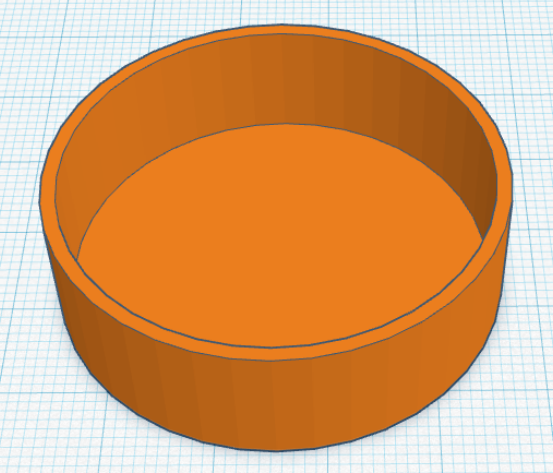
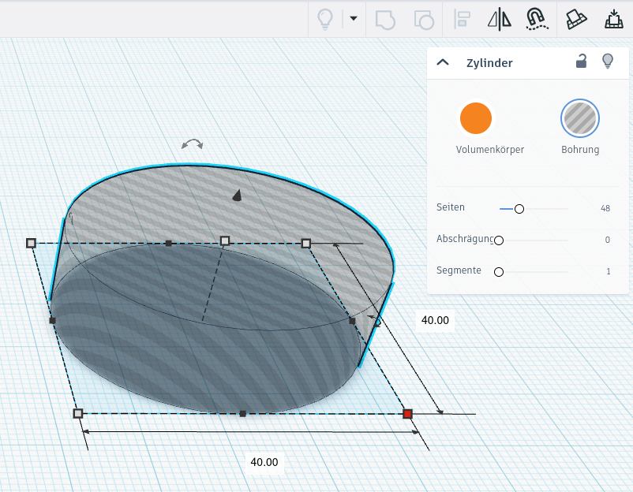
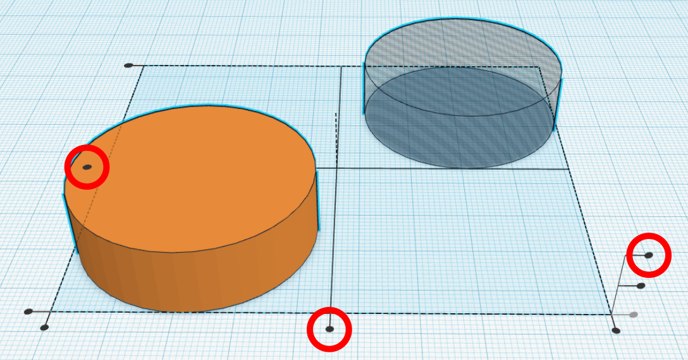
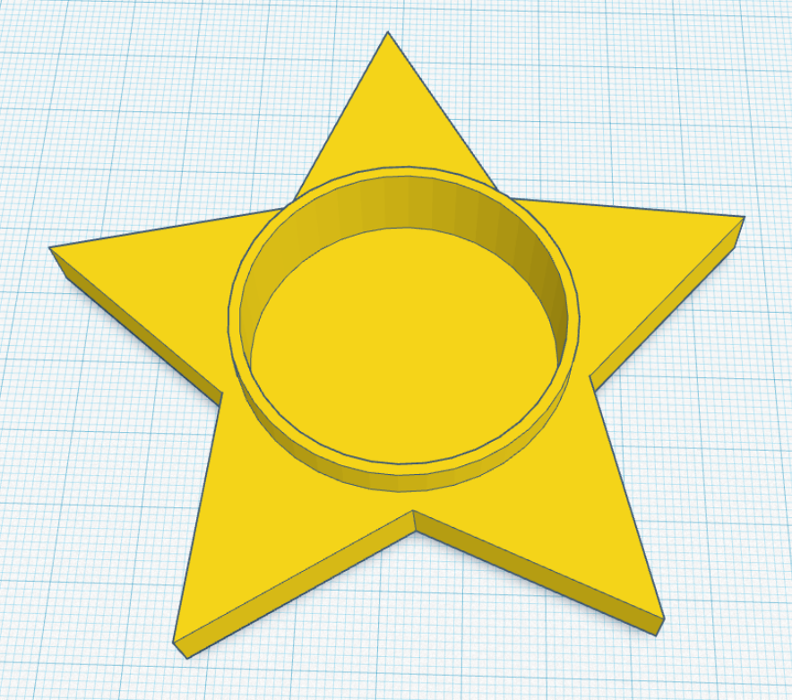

# Teelichthalter



Heute wollen wir einen weihnachtlich verzierten Halter für ein batteriebetriebenes Teelicht konstruieren. Die meisten Teelichter haben einen Durchmesser von **39 mm**. Es gibt sie in verschiedenen Höhen zu kaufen.

{}
**Achtung:** Verwende den Halter nur unter Aufsicht eines Erwachsenen mit einem echten Teelicht!
{}

{}
1. Öffne Tinkercad.

2. Erstelle einen Zylinder mit einem Durchmesser von **40 mm** und einer Höhe von **12 mm**.

3. Setze seinen Zustand auf **„Bohrung“**. Dieser Zylinder ist die Vertiefung für das Teelicht.

    

4. Erstelle nun den äußeren Zylinder des Teelichthalters. Der Durchmesser soll genau **42,52 mm** betragen. Bei diesem Durchmesser bleibt später ein äußerer Rand von 1,26 mm um das Teelicht. Diese Wandstärke entspricht bei den meisten 3D-Druckern genau drei parallelen Linien, so dass der Druck nicht so lange dauert.

5. Die Höhe des Zylinders ist **12,8 mm**. Dadurch bekommt der Boden des Halters später eine Dicke von 0,8 mm.

6. Markiere nun die beiden Zylinder, indem du mit der Maus einen Rahmen um beide ziehst.

7. Klicke oben rechts auf **„Ausrichten“**.

    

8. Klicke auf die **drei** im nächsten Bild markierten schwarzen Kreise. Dadurch zentrierst du die beiden Zylinder und sorgst dafür, dass ein Boden unter der Bohrung entsteht.

    

9. Danach kannst du die beiden Zylinder vereinigen, indem du oben rechts auf **„Vereinigungsgruppe“** klickst.

    

10. Das Ergebnis sollte wie im folgenden Bild aussehen.

    

    Damit ist die Grundform des Teelichthalters fertig.

11. Du kannst diesen Teelichthalter nun nach Belieben verzieren.
{}

## Mögliche Verzierungen
    
- Füge deinen Namen oder den Namen deines Lieblingsmenschen an der Außenseite des Halters hinzu.
- Schmücke den Teelichthalter mit (weihnachtlichen) Motiven, z.&nbsp;B. Sterne, Herzen, Schneeflocken, Schneemänner, Engel, Wichtel, Schlitten, Weihnachtsbäume usw.
- Kombiniere den Teelichthalter mit anderen geometrischen Körpern, wie z.&nbsp;B. im folgenden Bild. Dazu solltest du die Gruppierung des Grundkörpers aufheben (über den entsprechenden Knopf oben rechts), alles markieren und neu gruppieren. Dadurch wird die Bohrung für das Teelicht von allen Körpern abgezogen, sodass wieder Platz für das Teelicht ist.

    
