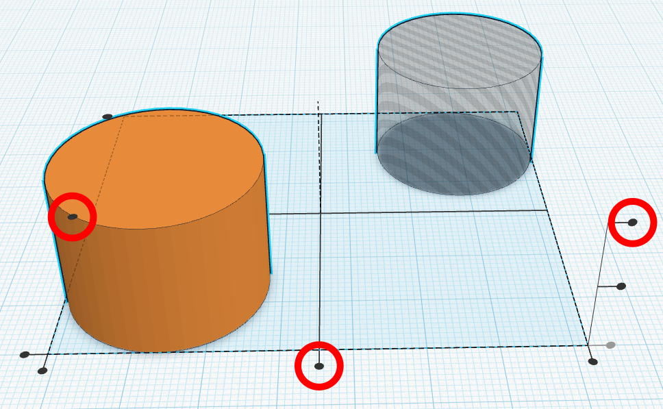
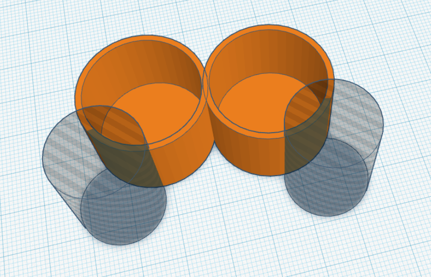

# Münzturm



Heute wollen wir einen Halter für die Aufbewahrung von Münzen konstruieren.



Es gibt insgesamt acht verschiedene Euromünzen, von der Cent-Münze bis zum 2-Euro-Stück. Die folgende Tabelle enthält die Dicke und den Durchmesser jeder einzelnen Münze.

|  Münze       | Dicke der Münze | Durchmesser der Münze | Innendurchmesser des Lochs | Außendurchmesser des Zylinders |
|--------------|----------------:|----------------------:|---------------------------:|-------------------------------:|
| 1&nbsp;Cent  | 1,67 mm         | 16,25 mm              | **17,25 mm**               | **19,77 mm**                  | 
| 2&nbsp;Cent  | 1,67 mm         | 18,75 mm              | **19,75 mm**               | **22,27 mm**                  | 
| 5&nbsp;Cent  | 1,67 mm         | 21,25 mm              | **22,25 mm**               | **24,77 mm**                  | 
| 10&nbsp;Cent | 1,93 mm         | 19,75 mm              | **20,75 mm**               | **23,27 mm**                  | 
| 20&nbsp;Cent | 2,14 mm         | 22,25 mm              | **23,25 mm**               | **25,77 mm**                  | 
| 50&nbsp;Cent | 2,38 mm         | 24,25 mm              | **25,25 mm**               | **27,77 mm**                  | 
| 1&nbsp;Euro  | 2,33 mm         | 23,25 mm              | **24,25 mm**               | **26,77 mm**                  | 
| 2&nbsp;Euro  | 2,20 mm         | 25,75 mm              | **26,75 mm**               | **29,27 mm**                  | 

Außerdem wird in der vierten Spalte der **Durchmesser eines passenden Lochs** angegeben, in das die jeweilige Münze gut hineinpasst. In der letzten Spalte findest du den Außendurchmesser des zugehörigen Zylinders. Gruppierst du später das Loch und den Zylinder, dann entsteht ein Becher mit einer Randdicke von 1,26&nbsp;mm, in den die Münzen gut hineinpassen.

{}
Diese Randdicke sorgt dafür, dass der Becher schnell gedruckt werden kann. Der 3D-Drucker kann dann genau drei Spuren nebeneinanderlegen und muss keine innere Füllung (Infill) drucken.
{}

Für welche Münzen du deinen Halter konstruieren möchtest, kannst du selbst entscheiden. Vielleicht schaffst Du sogar einen Halter für *alle* Euromünzen?

Die folgende Anleitung verwendet die Maße für das 2-Euro-Stück. Für andere Münzen musst du die unterstrichenen Maße anpassen.

{}
1. Öffne Tinkercad.

2. Erstelle einen Zylinder mit einem Durchmesser von <u>**26,75&nbsp;mm**</u> und einer Höhe von z.&nbsp;B. **20&nbsp;mm**.

3. Setze seinen Zustand auf **„Bohrung“**. Dieser Zylinder ist die Vertiefung für die Münzen.
    

4. Erstelle nun den äußeren Zylinder des Bechers. Der Durchmesser soll <u>**29,27&nbsp;mm**</u> betragen. Bei diesem Durchmesser bleibt später ein äußerer Rand von 1,26&nbsp;mm.

5. Die Höhe des Zylinders ist **20,8&nbsp;mm** (genau 0,8&nbsp;mm höher als die im 2. Schritt erstellte Bohrung). Dadurch bekommt der Boden des Halters später eine Dicke von 0,8&nbsp;mm.

6. Markiere nun die beiden Zylinder, indem du mit der Maus einen Rahmen um beide ziehst.

7. Klicke oben rechts auf **„Ausrichten“**.
    

8. Klicke auf die **drei** im nächsten Bild markierten schwarzen Kreise. Dadurch zentrierst du die beiden Zylinder und sorgst dafür, dass ein Boden unter der Bohrung entsteht.
    

9. Jetzt kannst Du die beiden Zylinder **gruppieren**. Damit ein neuer Körper entsteht, erzeugen wir dazu eine **Vereinigungsgruppe**. Den Knopf dazu findest du ebenfalls oben rechts. Das Ergebnis sollte wie im rechten Bild aussehen.
    

      <ul>
        <li>
          
        </li>
        <li>
          
        </li>
      </ul>
    

10. Damit ist der erste Münzbecher fertig.

11. Konstruiere auf dieselbe Art Becher für weitere Münzen.

12. Du kannst die Höhen der Becher variieren, damit dein Münzturm interessanter aussieht.

13. Ordne alle Münzbecher an, z.&nbsp;B. in einem Kreis oder in einer Linie. Achte darauf, dass sich die einzelnen Becher genug überlappen, aber *ohne* die Löcher für die Münzen zu überlappen.

14. Nun erzeugen wir Ausschnitte in den einzelnen Münzbechern, damit wir die Münzen besser herausnehmen können.

15. Füge dazu eine neue Zylinder-Bohrung hinzu. Der Durchmesser ist nicht so wichtig. Wir nehmen einfach die voreingestellten **20&nbsp;mm**. Vergrößere die Höhe, bis er höher als der entsprechende Münzbecher ist, z.&nbsp;B. auf **30&nbsp;mm**. Verschiebe die Bohrung etwas an den Rand des Münzbechers.

16. Dupliziere die Bohrung über den Knopf oben links. Jeder Münzbecher benötigt eine Bohrung.
    

    

17. Danach kannst du alle Münzbecher und Bohrungen **vereinigen**, indem du wieder eine **Vereinigungsgruppe** erstellt. Den Knopf dazu findest du wieder oben rechts (siehe Schritt&nbsp;9). Das Ergebnis könnte wie im folgenden Bild aussehen. 
    

    Damit ist der Münzturm fertig. Vielleicht schaffst du auch einen kompletten Münzturm wie auf dem Bild ganz oben?
{}
