# Drehbarer Stern



Heute erstellen wir einen Weihnachtsanhänger, der aus zwei drehbaren Sternen besteht.

{}

1. In Tinkercad siehst du rechts die Seitenleiste mit den verfügbaren Formen. Klicke oberhalb der Formen rechts auf die Lupe und suche nach „Stern“.  Klicke dann auf den **blauen** „2D‑Stern“ und platziere ihn auf der Arbeitsebene. Das wird der innere Stern.

    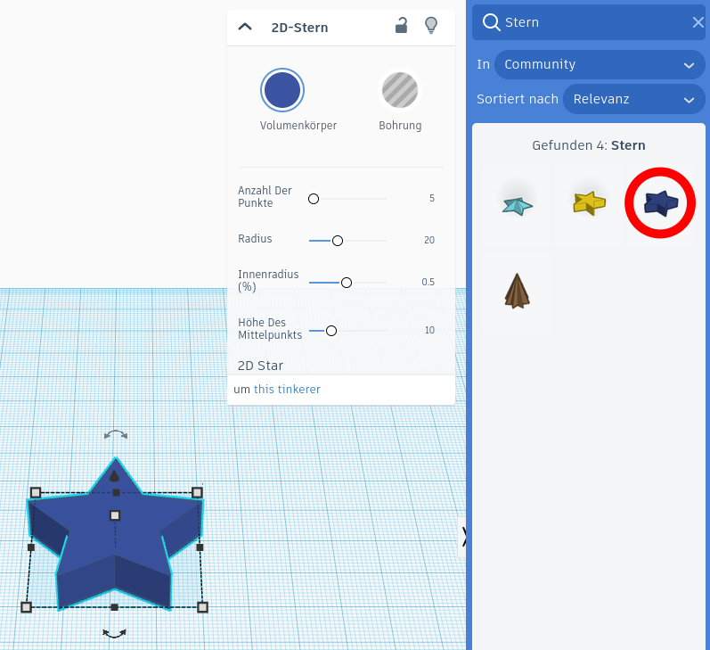

2. Ändere den Radius auf **21** und die Höhe des Mittelpunkts auf **6.5**.

    > [!CAUTION]
    > **Achtung:**
    > Statt eines Dezimalkommas musst du einen Punkt eingeben!

3. Erzeuge zwei Kopien des Sterns, indem du ihn auswählst (anklickst) und erst die Tastenkombination **Strg+C** und dann zweimal die Tastenkombination **Strg+V** drückst.

4. Setze den Radius des *ersten* neuen Sterns auf **31.5** und ändere seinen Zustand auf **„Bohrung“**.

5. Ändere den Radius des *zweiten* neuen Sterns auf **41**.

6. Markiere den *großen* und den *mittleren* Stern (z.&nbsp;B. indem du einen Rahmen um beide ziehst) und klicke rechts oben auf **„Ausrichten“**.

7. Wie im folgenden Bild gezeigt, klicke nun auf die beiden Kreise in der Mitte des Rahmens, damit der mittlere Stern genau in der Mitte des großen Sterns ist.

    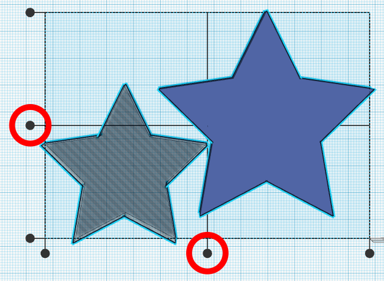

8. Vereinige nun die beiden Sterne, damit nur ein sternförmiger Rahmen übrig bleibt. Erzeuge dazu eine **Vereinigungsgruppe** (keine Bündelgruppe).

9. Gehe genauso wie in **Schritt 7** vor, um den kleinen Stern genau in der Mitte des sternförmigen Rahmens zu positionieren.

    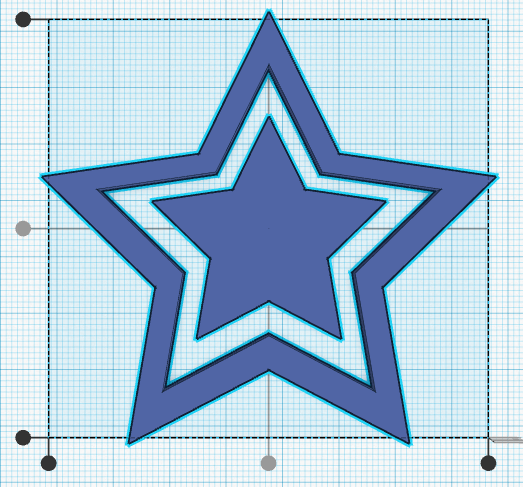

10. Damit beim Aufhängen des Anhängers der kleine Stern in der Mitte nicht nach oben rutscht, fügen wir noch einen Stopper ein. Erzeuge dazu einen liegenden Zylinder mit einem Durchmesser von **6,5 mm**. Drehe ihn so, dass er senkrecht liegt, also von unten nach oben. Orientiere dich an dem folgenden Bild.

    

11. Wähle den sternförmigen Rahmen und den Zylinder aus und klicke auf **„Ausrichten“**. Zentriere beides nun horizontal und lege den Zylinder auf die Arbeitsebene, so wie im folgenden Bild.

    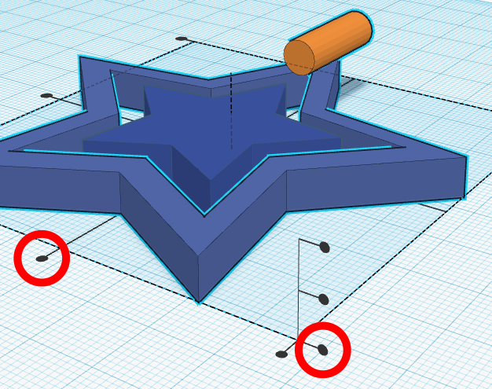

12. Ändere die Länge des Zylinders so, dass er **2 mm** (also zwei kleine Kästchen) Abstand zur Spitze des kleinen Sterns hat und bis zur Spitze des äußeren sternförmigen Rahmens geht.

    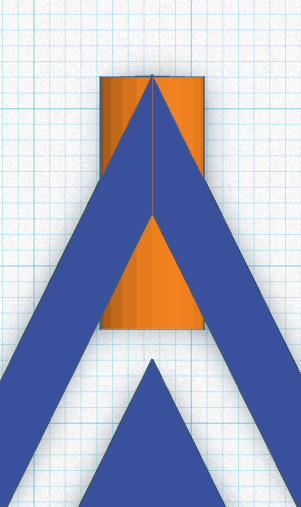

13. Dupliziere den Zylinder (z.&nbsp;B. mit **Strg+D**) und verschiebe ihn **mit gedrückter Umschalt-Taste** nach unten, so wie im folgenden Bild.
    > [!NOTE]
    > Mit der Umschalt-Taste schreibst du normalerweise Großbuchstaben. Sie heißt auch Shift-Taste.

    > [!TIP]
    > Durch das Drücken der Umschalt-Taste kannst du den Zylinder genau senkrecht verschieben, ohne dass er am Raster ausgerichtet wird.

    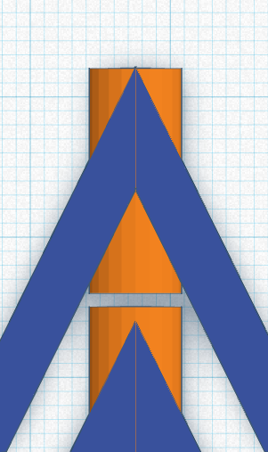

14. Dupliziere den Zylinder noch einmal und verschiebe ihn wieder mit gedrückter Umschalt-Taste nach unten, bis er außerhalb des Anhängers ist. Wir brauchen ihn später.

15. Vereinige den oberen Zylinder mit dem sternförmigen Rahmen.

16. Vereinige den unteren Zylinder mit dem kleineren Stern in der Mitte.

17. Damit sich der Anhänger drehen kann, brauchen wir eine Achse und Löcher, in denen sich die Achse drehen kann. Erzeuge für die Löcher einen liegenden Zylinder mit einem Durchmesser von **4 mm** und ändere seinen Zustand auf **„Bohrung“**.

18. Ändere seine Länge, sodass er durch den kompletten sternförmigen Rahmen geht.

19. Zentriere den Zylinder horizontal auf dem sternförmigen Rahmen und lege ihn auf die Arbeitsebene, so wie im folgenden Bild.

    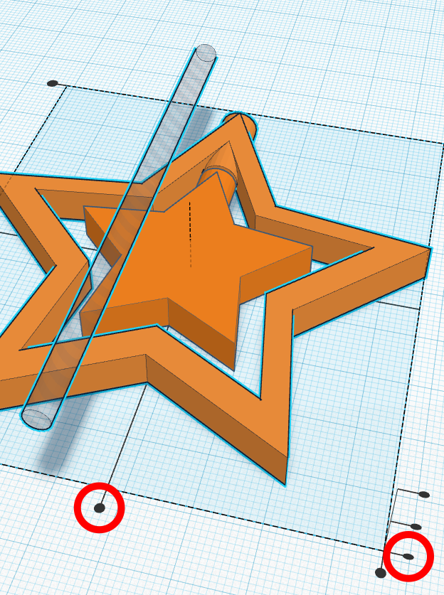

20. Wähle den Zylinder aus, klicke auf den kleinen nach oben gerichteten Pfeil und bewege die Maus mit gedrückter Maustaste nach oben. Dadurch wird der Zylinder nach oben verschoben. Verschiebe den Zylinder so um genau **1,25 mm** nach oben. Du kannst die Zahl in das kleine Zahlenfeld eintragen.

    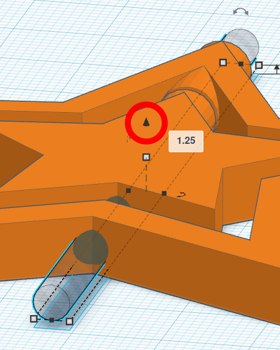

21. Vereinige den sternförmigen Rahmen und den Zylinder.
    
22. Erstelle für die Achse einen langen liegenden Zylinder mit einem Durchmesser von **2,8 mm**.

23. Führe die Schritte 18 und 19 nochmal aus. Verschiebe ihn in Schritt 19 um **1,85 mm** nach oben.

24. Ändere die Länge des Zylinders so wie im folgenden Bild gezeigt.

    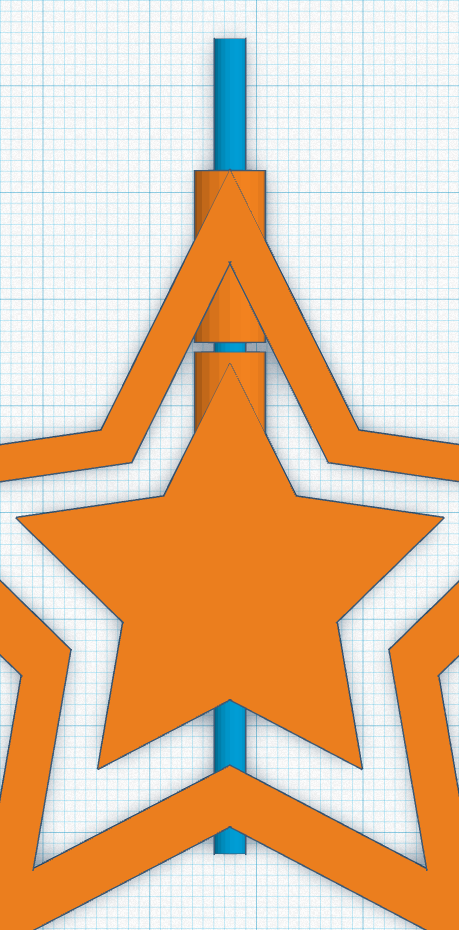

25. Vereinige den Zylinder und den kleinen Stern in der Mitte.

26. Verkürze und verschiebe den dritten Zylinder aus Schritt 14, sodass er die Achse unten abschließt.

    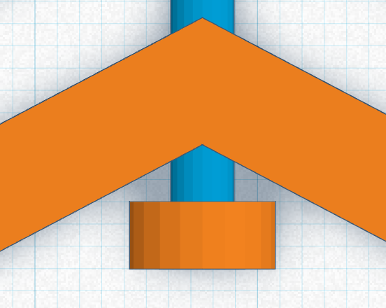

27. Zum Schluss benötigen wir noch eine Möglichkeit, um den Stern später aufzuhängen. Erstelle dazu ein **Polygon**.

    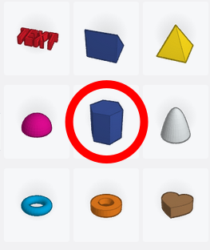

28. Ändere die Breite und Höhe auf **6,5 mm**.

29. Ordne es wie im folgenden Bild oben auf der Achse an. Das Loch ist ein Zylinder mit einem Durchmesser von **3 mm**.

    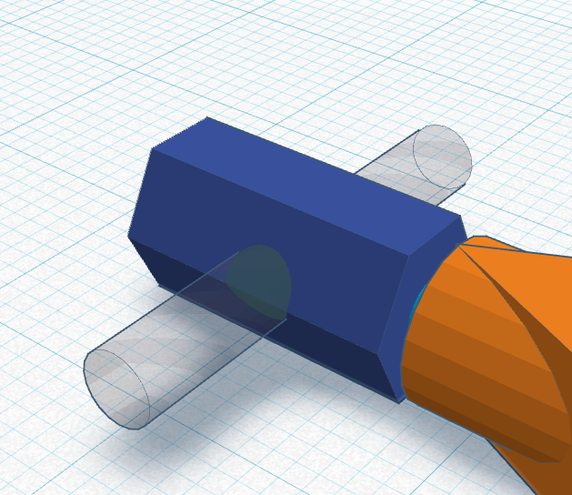

30. Vereinige zuerst den kleinen Stern in der Mitte mit dem Polygon. Vereinige danach den kleinen Stern mit der Bohrung.

    > [!TIP]
    > Damit ist der drehbare Stern fertig.
{}
