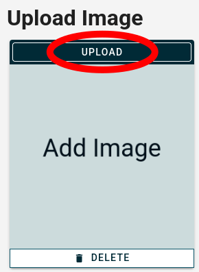
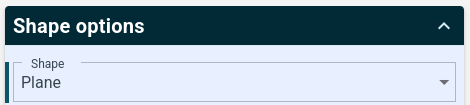
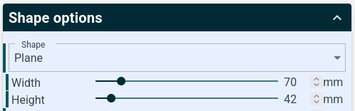
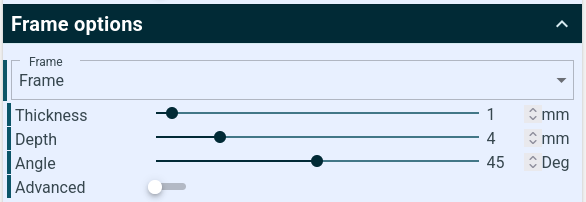

# Lithophanie

Heute erstellen wir eine sogenannte Lithophanie. Das ist eine dünne Platte mit einem Relief, also mit Bereichen unterschiedlicher Dicke. Wenn du diese Platte gegen das Licht hältst, wird ein Bild sichtbar.

{}

1. Suche im Internet z.&nbsp;B. bei **https://duckduckgo.com/** nach passenden Bildern für eine Lithophanie. Gebe dazu einen passenden Suchbegriff ein, z.&nbsp;B. „Songoku“ und drücke Enter. Danach kannst du oben auf **„Bilder“** klicken, um passende Bilder anzuzeigen.

    

2. Hast du ein passendes Bild gefunden, klicke es an und wähle dann **„Datei anzeigen“**. Dadurch öffnet sich das Bild in einem neuen Tab. Klicke mit der **rechten Maustaste** auf das Bild und wähle **„Bild speichern unter“** (manchmal heißt es auch **„Grafik speichern unter“** oder ähnlich), um es auf der Festplatte zu speichern.
       
    Alternativ kannst du natürlich auch ein eigenes Foto verwenden. Das Foto muss dann als Datei auf dem Computer vorhanden sein.

3. Öffne im Browser die Seite **https://tool.itslitho.com/**.

4. Klicke oben links auf **„UPLOAD“**.

    

5. Klicke danach wieder auf **„UPLOAD“**.

    

6. Wähle das gewünschte Bild aus.

7. Klicke dann oben auf **„MODEL“**. Du siehst jetzt eine Vorschau der Lithophanie.

8. Bei den **„Shape options“** kannst die Form (engl. *shape*) der Lithophanie festlegen.

    

    Wähle entweder **„Plane“** (Rechteck) oder **„Arc“** (gebogenes Rechteck) aus.

    > [!TIP]
    > Die Lithophanien werden besonders detailliert, wenn man sie senkrecht druckt. Da andere Formen wie Kreise oder Herzen aber nur eine kleine Grundfläche haben, müssten sie mit Unterstützung (Support) gedruckt werden. Daher verwenden wir sie hier nicht.

9. Über die Optionen **Width** und **Height** kannst du die Breite und Höhe der Lithophanie einstellen. Setze den größeren der beiden Werte auf **70 mm**.

    

10. Damit die Lithophanie besser gedruckt werden kann, solltest du einen dickeren Rahmen einstellen. Dazu muss unter **„Frame options“** (Einstellungen des Rahmens) die Option **„Frame“** (Rahmen) aktiviert sein.

    

11. Setze die **„Thickness“** (Dicke) des Rahmens auf **1 mm**. 

12. Sobald du mit allen Einstellungen zufrieden bist, klicke rechts unten auf **„DOWNLOAD“** und dann auf **„Lithophane“**.

{}

> [!TIP]
> Damit ist deine Lithophanie fertig.

## Slicing

Bevor die Lithophanie gedruckt werden kann, muss sie erst mit dem Slicer für den Druck vorbereitet werden. Beachte die folgenden Punkte, damit deine Lithophanie möglichst gut gedruckt wird.

{}

1. Starte den Slicer und lade die STL-Datei.

2. Positioniere die Lithophanie **senkrecht** und **von vorne nach hinten** auf der Druckplatte. Dadurch schwingt es nicht so stark, wenn sich die Druckplatte vor und zurück bewegt.

3. Setze die Schichthöhe (engl. *layer height*) auf **0,12 mm**.

4. Setze die Anzahl an Schalen (engl. *perimeters*) auf **99**.

5. Setze die Fülldichte (engl. *infill*) auf **0 %**.

{}

> [!TIP]
> Dadurch wird die Lithophanie massiv und mit hoher Qualität gedruckt.

