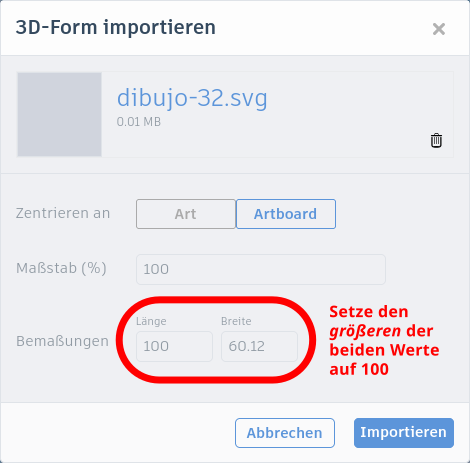
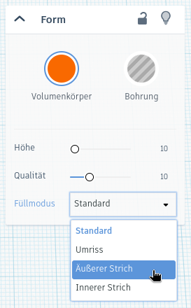
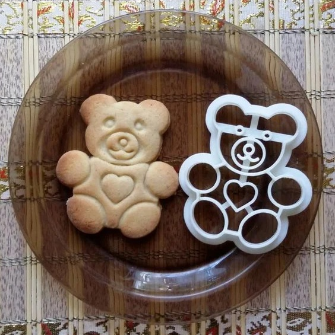
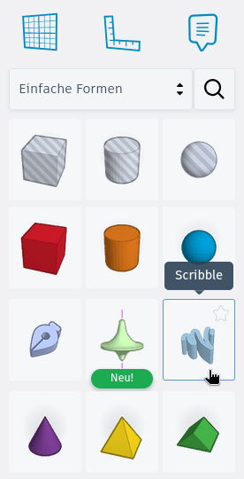
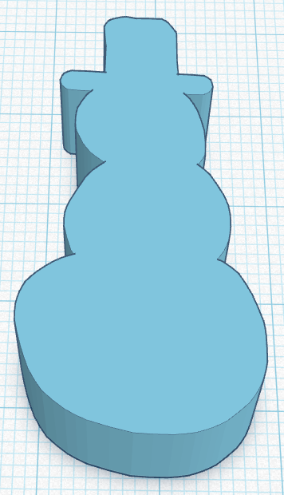

# Keksausstecher



Heute wollen wir einen Keksausstecher entwerfen, z.&nbsp;B. für leckere Weihnachts- oder Osterkekse.

{}

1. Suche im Internet nach einem passenden Bild. Das Bild sollte einen geschlossenen Umriss haben, damit die Kekse später gut aussehen. Außerdem muss es eine SVG-Datei sein.

    > [!NOTE]
    > SVG ist ein Dateiformat für Vektorgrafiken. Solche Grafiken können beliebig vergrößert und verkleinert werden, ohne dass Pixel sichtbar werden. SVG-Dateien können direkt in Tinkercad importiert werden.

    Du kannst z. B. die Internetseiten https://freesvg.org und https://www.svgrepo.com zur Suche verwenden. Verwende englische Suchbegriffe, um bessere Ergebnisse zu erhalten. Das Bild könnte z. B. so aussehen:

    

2. Lade eine passende SVG-Datei herunter und importiere sie in einem neuen Tinkercad-Entwurf. Klicke dazu oben rechts auf **Importieren** und wähle die korrekte Datei aus. Falls der Knopf fehlt, klicke zuerst oben rechts **auf die drei Punkte**, dann sollte er erscheinen.

    Es öffnet sich ein neues Fenster, in dem du die Länge und Breite angeben kannst.

    

    **Wichtig:** Ändere **den größeren** der beiden Werte (also die Länge *oder* die Breite) auf **100**. Dadurch wird das 3D-Objekt maximal 10&nbsp;cm lang bzw. breit.

    > [!CAUTION]
    > Nach dem Import solltest du das Objekt **nicht** mehr in der Größe verändern (skalieren)! Die im Folgenden festgelegten Linienbreiten stimmen sonst nicht mehr!

    Der Import kann dann einen Moment dauern. Das Ergebnis sollte wie in folgendem Bild aussehen:

    

3. Nach dem Import kannst du das Objekt auswählen und rechts den Füllmodus anpassen. Wähle hier **„Äußerer Strich“** aus.

    

    Dadurch berücksichtigt Tinkercad nur die äußere Kontur bei der Erstellung des 3D-Objekts:

    

    > [!TIP]
    > Je nach Vorlage kann es auch sinnvoll sein, die Option „Ecken“ auf einen anderen Wert zu setzen, z.&nbsp;B. auf „Rund“. Probiere es aus!

4. Dupliziere den Umriss mit der Tastenkombination **Strg+D** oder klicke oben links auf den dritten Knopf **„Duplizieren“**.

5. Für einen der Umrisse, ändere im rechten Fenster die **Strichbreite** auf **1.26** (geschrieben mit einem Dezimalpunkt!).

    > [!NOTE]
    > Diese Breite von 1,26&nbsp;mm entspricht bei den meisten 3D-Druckern genau drei Konturlinien. Dadurch dauert der Druck nicht so lange.

    Ändere auch die **Farbe**, damit du die beiden Objekte besser unterscheiden kannst.

    

6. Wähle den zweiten (äußeren) Umriss aus (im Bild orange gefärbt). Ändere im rechten Fenster die Strichbreite auf **10** und die Höhe auf **1**. Das ist der Rand, an dem du den Ausstecher festhalten kannst.

7. Falls der Ausstecher etwas kantig ist, kannst du bei **beiden** Objekten im rechten Fenster die Qualität erhöhen, z.&nbsp;B. auf **20**. Beachte aber, dass dadurch Tinkercad bei der Bearbeitung langsamer werden kann!

8. **Vereinige** beide Objekte.

9. Denke daran, dass die Kekse später spiegelverkehrt sind. Überlege daher, ob du den Keksausstecher spiegeln möchtest. Wähle ihn dazu aus und klicke oben rechts auf **„Spiegeln“**. Das Ergebnis sollte wie im folgenden Bild aussehen:

    

{}

> [!TIP]
> Damit ist dein Keksausstecher fertig.

## Anpassungen

Du kannst den Keksausstecher auch noch weiter verbessern, indem du weitere Details, wie z.&nbsp;B. Augen oder zusätzliche Konturen hinzufügst. Überlege, was du ändern musst, damit diese Details den Keks nur an der Oberfläche eindrücken. Hier siehst du ein Beispiel vom Nutzer [Protonik](https://www.thingiverse.com/Protonik), das du auf [Thingiverse](https://www.thingiverse.com/thing:934266) finden kannst.

## Eigene Entwürfe

### Tinkercad

Du kannst auch einen komplett eigenen Entwurf für einen Keksausstecher erstellen. Erstelle dazu eine Form direkt in Tinkercad, z.&nbsp;B. mit der speziellen Form **„Scribble“** oder mit den vielen anderen Objekten, die zur Verfügung stehen.

{}

1. Wähle die Form **Scribble** aus.

    

2. Es öffnet sich ein neuer Bereich, in dem du mit der Maus eine Form zeichnen kannst. Wenn du fertig bist, klicke auf **Fertig**.

    

3. Nun kannst du das resultierende Objekt als SVG-Datei exportieren. Wähle es dazu aus und klicke dann oben rechts auf **Exportieren** (falls der Knopf fehlt, klicke wieder oben rechts auf die drei Punkte). Klicke dann auf **.SVG**.
    

    - 
    - 

    

    > [!TIP]
    > Du kannst dir das wie ein Foto von oben vorstellen. Aus dem dreidimensionalen Objekt (links) entsteht eine zweidimensionale Abbildung (rechts).

4. Diese SVG-Datei kannst du anschließend wieder in Tinkercad importieren, um mit dieser Anleitung einen Ausstecher zu erzeugen.

    

{}

### Inkscape

Mit dem kostenlosen Open-Source-Programm [Inkscape](https://inkscape.org/de/) kannst du SVG-Dateien erstellen und bearbeiten. Außerdem kannst du über die Funktion **Pfad → Bitmap nachzeichnen…** Pixelgrafiken in Vektorgrafiken umwandeln und danach in Tinkercad verwenden. Auf diese Weise kannst du auch *selbst gezeichnete Bilder* zunächst einscannen und anschließend mit Inkscape in Vektorgrafiken umwandeln!
