# Einkaufswagen-Chip

 

Heute erstellen wir einen Schlüsselanhänger, mit dem die Kette eines Einkaufswagens gelöst werden kann. Danach kann der Schlüsselanhänger gedreht und entfernt werden, auch ohne dass der Einkaufswagen mit einer Kette verbunden wird.

Den Entwurf werden wir in Inkscape durchführen, um die Bedienung des Programms zu erlernen.

{}

1. Start Inkscape, indem du die Windows-Taste drückst und „Inkscape“ eingibst. Das Programm sollte dann links angezeigt werden, sodass du es per Enter-Taste starten kannst.

2. Aktiviere das Raster über den Menüpunkt **Ansicht → Seitengitter**.

3. Wähle den Menüpunkt **Datei → Dokumenteinstellungen…** und prüfe, ob das Raster richtig eingestellt ist. Die Rasterlinien sollen in X- und Y-Richtung einen Abstand von 1 mm haben, so wie im folgenden Bild:

    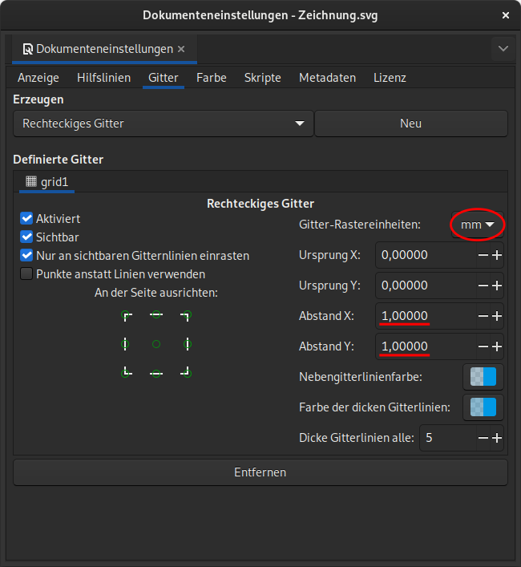

4. Wir wollen zuerst den großen Kreis erstellen. Aktiviere das **Ellipsenwerkzeug** in der linken Werkzeugleiste:

    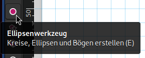

5. Um einen Kreis um einen bestimmten Punkt zu erstellen, halte die **Strg-Taste** *und* die **Umschalt-Taste** gleichzeitig gedrückt, klicke mit der linken Maustaste auf einen Gitterpunkt und ziehe mit gedrückter Maustaste einen Kreis auf:

    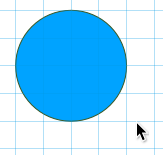

6. Wähle den Kreis aus, indem du ihn mit der linken Maustaste anklickst.

7. Klicke in der Symbolleiste am rechten Rand auf den Knopf **'Füllung und Kontur' öffnen**:

    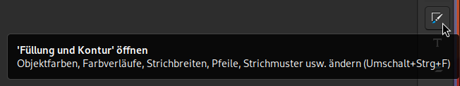

8. Wähle auf dem Reiter **Muster der Kontur** als Linienbreite **Haarlinie** aus:

    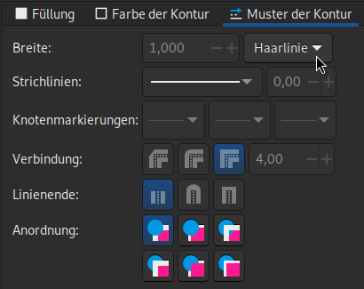

    Auf dem Reiter **Füllung** kannst du die Füllfarbe festlegen. Sie sollte nicht zu dunkel sein, damit die Rasterlinien noch erkennbar sind.

9. Der Kreis soll genauso groß wie eine 1-Euro-Münze sein. Wähle ihn dazu mit der linken Maustaste aus und setze seine Breite (**B**) und Höhe (**H**) in der oberen Symbolleiste auf **23,25 mm**:

    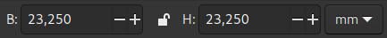

    > [!TIP]
    > Falls die beiden Felder nicht angezeigt werden, musst du das Inkscape-Fenster verbreitern.

10. Damit wir den Kreis leichter ausrichten können, aktivieren wir das automatische Einrasten des Mittelpunkts. Klicke dazu in der Symbolleiste am rechten Rand ganz oben auf den **Pfeil**, klicke dann auf **Fortgeschritten** und aktiviere das **Einrasten** und den Punkt **Zentren**:

    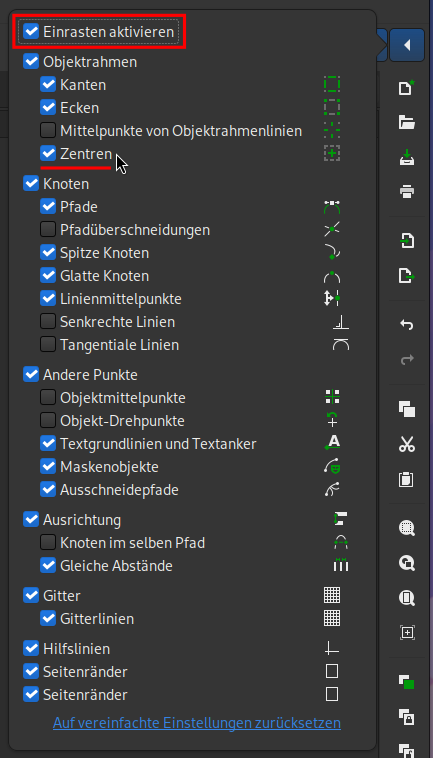

11. Verschiebe den Kreis so, dass sein **Mittelpunkt** auf einem Rasterpunkt liegt.

12. Erzeuge auf die gleiche Weise einen zweiten Kreis mit einem **Durchmesser** von **10 mm**. Verschiebe ihn so, dass die **rechte obere Ecke seines Rahmens** auf dem Mittelpunkt des großen Kreises liegt. Verschiebe ihn danach um **5 mm** nach links, so wie im folgenden Bild:

    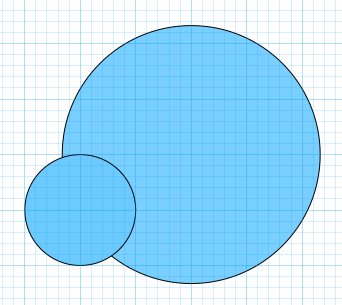

13. Markiere beide Kreise und wähle im Hauptmenü den Punkt **Pfad → Differenz**:

    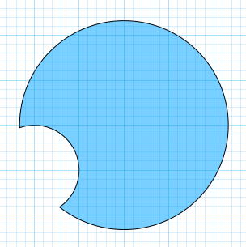

14. Füge zwei Rechtecke hinzu um die beiden Spitzen zu begradigen:

    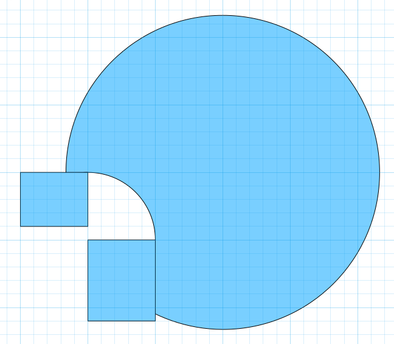

15. Ziehe **nacheinander** die beiden Rechtecke vom großen Kreis ab:

    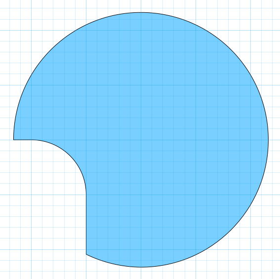

16. Erzeuge einen Kreis mit einem **Durchmesser** von **6 mm**. Daraus wird später das Loch, um den Anhänger am Schlüssel zu befestigen. Platziere ihn so, dass sein Mittelpunkt genau **40 mm** unter dem Mittelpunkt des großen Kreises liegt. Um diesen Punkt einfacher zu finden, kannst du zuerst ein Rechteck mit einer Höhe von 40 mm erzeugen:

    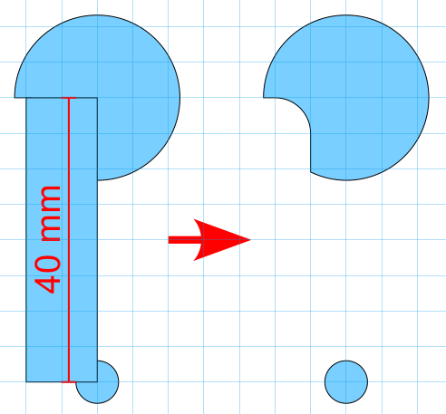

17. Die bisherigen Schritte hätten wir auch problemlos in Tinkercad durchführen können. Das tolle an Inkscape ist, dass wir nun auch echte Kurven erzeugen können.

    Wähle in der linken Symbolleiste das **Zeichenwerkzeug** aus:

    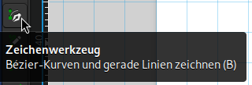

18. Zeichne den Umriss des Griffs, z.&nbsp;B. so wie im folgenden Bild.

    Wenn du nacheinander an verschiedenen Stellen mit der **linken Maustaste** klickst, entsteht ein Pfad mit **Ecken**, so wie bei den obersten drei Knoten im Bild. 

    Wenn du stattdessen mit der linken Maustaste klickst, sie **gedrückt** hältst und dann die Maus bewegst, entstehen Knoten mit **geglätteten Übergängen**, so wie im unteren Teil des Bildes. Über das Verschieben der kreisförmigen Anfasser kannst du die Stärke der Rundung einstellen.

    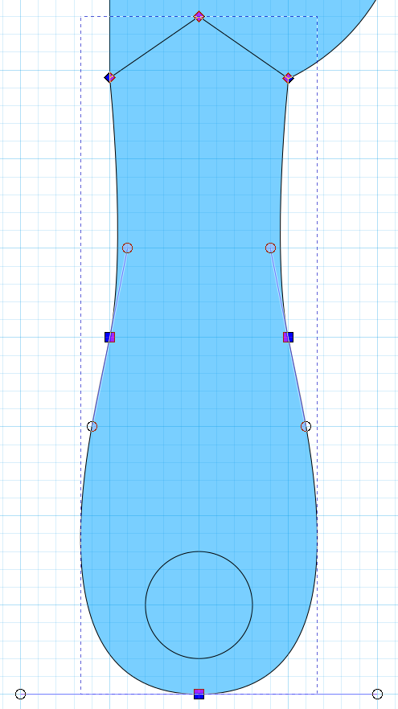

19. Verbinde den großen Kreis mit dem Griff indem du beides auswählst und den Menüpunkt **Pfad → Vereinigung** auswählst. Ziehe das untere Loch ab. Das Ergebnis sollte so aussehen:

    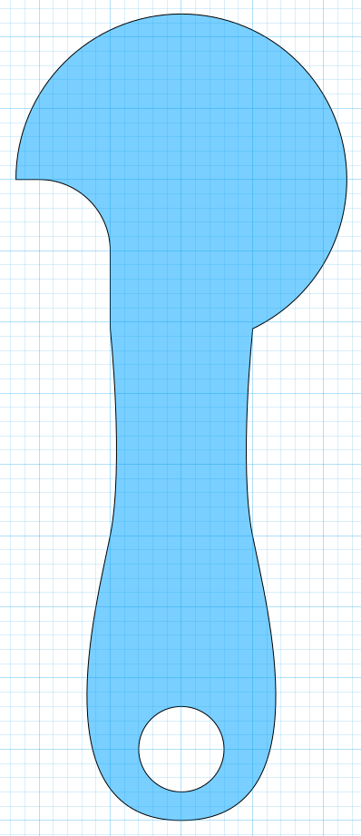

20. Speichere die Grafik in einer SVG-Datei. Wähle dazu den Menüpunkt **Datei → Speichern**.

21. Importiere diese Datei in einem neuen **3D-Entwurf** in **Tinkercad**.

22. Gib als Höhe einen Wert von **2.2** (mit Dezimalpunkt) an. Dadurch wird der Schlüsselanhänger etwas dünner als eine 1-Euro-Münze.

23. Du kannst noch eigene Verbesserungen vornehmen, z. B. eine Beschriftung.

{}

