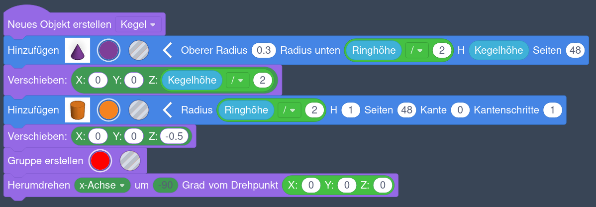
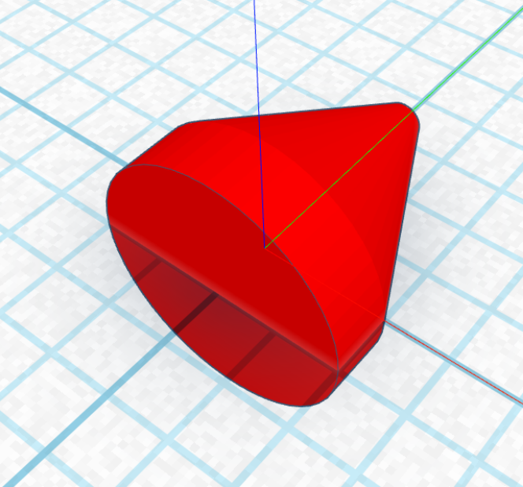
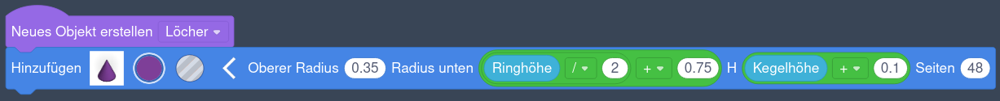
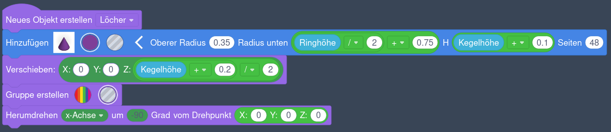
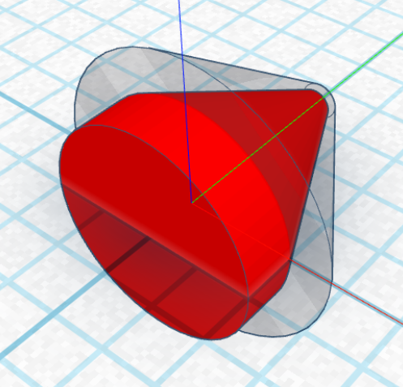

# Drehbarer Schlüsselanhänger



Bisher haben wir in Tinkercad Grundkörper erzeugt und kombiniert, um Objekte zu erzeugen. Die Anordnung und Veränderung der Körper passierte dabei mit der Maus. Für komplizierte Objekte kann diese Vorgehensweise aber zu langwierig und ungenau sein. Deshalb wollen wir heute einen drehbaren Schlüsselanhänger erstellen, indem wir die Konstruktion mit Codeblöcken beschreiben.

{}

1. Erzeuge in Tinkercad einen neuen Entwurf auf Basis von **Codeblöcken**.

    

2. Als Erstes erzeugen wir einige **Variablen**. Das sind Eigenschaften des Schlüsselanhängers, denen wir Namen geben. Ein Beispiel ist die *Anzahl der Ringe*. Später können wir die Zahlenwerte einfach ändern und der Schlüsselanhänger verändert sich sofort entsprechend.

    1. Scrolle die Blockauswahl ganz nach unten, bis du den Abschnitt **Variablen** siehst. Schneller geht es, wenn du links auf „Variablen“ klickst.
        

    2. Klicke auf den Knopf **Variable erstellen …**.

    3. Gib als Namen **„Anzahl der Ringe“** ein und klicke auf **Erstellen**.
        

    4. Für jede Variable entstehen neue Blöcke, die wir später beim Erstellen des Schlüsselanhängers benutzen.
        

    5. Ziehe den Block **Anzahl der Ringe auf 0 einstellen** auf die rechte Fläche. Ändere die Zahl im Block von 0 auf **3**.
        

    6. Erzeuge nun die restlichen Variablen wie im folgenden Bild. Die weißen Kommentare kannst du weglassen. Sie dienen nur als Erklärung der einzelnen Variablen und haben keinen weiteren Einfluss.
        
    {style="list-style: lower-alpha;"}

3. Mit diesen Variablen können wir jetzt die Werte weiterer Variablen berechnen. Diese Berechnungen vereinfachen später die Beschreibung des Schlüsselanhängers.

    1. Erzeuge eine neue Variable und nenne sie **„Differenz der Ringgrößen“**.

    2. Ziehe den Block **Anzahl der Ringe auf 0 einstellen** auf die rechte Fläche. Ändere die Variable zu **„Differenz der Ringgrößen“**.

    3. Ziehe einen grünen **„0 + 0“-Block** an die Stelle, wo der **Wert** steht.
        

        - 
        - 

        

    4. Ersetze die erste 0 mit einem blauen **„Ringabstand“-Block**.

    5. Ersetze die zweite 0 mit einem blauen **„Ringbreite“-Block**.
        

    6. Erzeuge jetzt die restlichen Berechnungen wie im folgenden Bild.
        
    {style="list-style: lower-alpha;"}

4. Als nächstes Erzeugen wir die Kegel, die als Drehpunkte dienen und über die sich die einzelnen Ringe berühren.

    1. Ziehe einen violetten Block **„Neues Objekt erstellen“** (in der Liste ganz unten) auf die Fläche und ändere den Namen auf **„Kegel“**.

    2. Füge aus der Gruppe **Formen** einen blauen Block **Kegel** hinzu.
        

    3. Klicke auf den weißen Pfeil und ändere die folgenden Eigenschaften des Kegels:
        - „Oberer Radius“ auf **0.3**,
        - „Radius unten" auf die Berechnung **„Ringhöhe / 2“** und
        - „H“ auf **„Kegelhöhe“**.

        

    4. Füge einen violetten **„Verschieben“-Block** hinzu und setze den Wert für **Z** auf die Berechnung **„Kegelhöhe/2“**.
        

    5. Füge einen **Zylinder** mit dem Radius **„Kegelhöhe/2“** und der Höhe **1** hinzu.
        

    6. Füge einen **„Verschieben“-Block** mit einem **Z-Wert** von **-0.5** hinzu.
        

    7. Füge einen violetten **„Gruppe erstellen“-Block** (in der Liste ganz unten) hinzu. Du kannst die Farbe frei wählen.
        >[!INFO]
        > Das Einfügen dieses Blockes bewirkt das Gleiche, wie wenn du in Tinkercad mehrere Objekte auswählst und auf „Vereinigungsgruppe“ klickst: Die Objekte werden kombiniert und es bleibt ein einzelnes Objekt übrig.

    8. Füge einen violetten **„Herumdrehen“-Block** hinzu. Stelle eine Drehung um die **x-Achse** um **‑90** Grad ein. Verwende als **Drehpunkt** einen grünen **„X:0 Y:0 Z:0“-Block**.

    9. Die komplette Beschreibung des Kegels sollte wie im folgenden Bild aussehen:
        

    10. Klicke unten auf den Play-Knopf  und prüfe das Ergebnis. Über den Knopf rechts daneben werden die Blöcke schneller abgearbeitet. Alle Blöcke werden von oben nach unten verarbeitet. Rechts oben siehst du das Ergebnis. Es sollte so wie im folgenden Bild aussehen:
        
    {style="list-style: lower-alpha;"}

5. Jetzt können wir die kegelförmigen Vertiefungen erzeugen, in denen sich die eben erstellten Kegel drehen. Dazu erstellen wir ein neues Objekt **„Loch“**.

    1. Ziehe einen violetten Block **„Neues Objekt erstellen“** (in der Liste ganz unten) auf die Fläche und ändere den Namen auf **„Loch“**.

    2. Füge aus der Gruppe **Formen** einen blauen Block **Kegel** hinzu.

    3. Klicke auf den weißen Pfeil und ändere die folgenden Eigenschaften des Kegels:
        - „Oberer Radius“ auf **0.35**,
        - „Radius unten" auf die Berechnung **„(Ringhöhe / 2) + 0.75“** und
        - „H“ auf die Berechnung **„Kegelhöhe + 0.1“**.
        
        

    4. Füge einen violetten **„Verschieben“-Block** hinzu und setze den Wert für **Z** auf die Berechnung **„(Kegelhöhe + 0.2) / 2“**.

    5. Füge einen violetten **„Gruppe erstellen“-Block** (in der Liste ganz unten) hinzu. Setze den Typ auf **Bohrung**.

    6. Füge einen violetten **„Herumdrehen“-Block** hinzu. Stelle eine Drehung um die **x-Achse** um **‑90** Grad ein. Verwende als **Drehpunkt** einen grünen **„X:0 Y:0 Z:0“-Block**.

    7. Die komplette Beschreibung sollte wie im folgenden Bild aussehen:
        
    {style="list-style: lower-alpha;"}

6. Nach dem Ausführen sollte das Ergebnis wie im folgenden Bild aussehen:
    
{}

