# Drehbarer Schlüsselanhänger



Bisher haben wir in Tinkercad Grundkörper erzeugt und kombiniert, um Objekte zu erzeugen. Die Anordnung und Veränderung der Körper passierte dabei mit der Maus. Für komplizierte Objekte kann diese Vorgehensweise aber zu langwierig und ungenau sein. Deshalb wollen wir heute einen drehbaren Schlüsselanhänger erstellen, indem wir die Konstruktion mit Codeblöcken beschreiben.

{}

1. Erzeuge in Tinkercad einen neuen Entwurf auf Basis von **Codeblöcken**.

    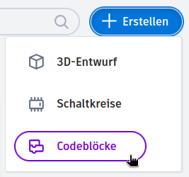

2. Als Erstes erzeugen wir einige **Variablen**. Das sind Eigenschaften des Schlüsselanhängers, denen wir Namen geben. Ein Beispiel ist die *Anzahl der Ringe*. Später können wir die Zahlenwerte einfach ändern und der Schlüsselanhänger verändert sich sofort entsprechend.

    1. Scrolle die Blockauswahl ganz nach unten, bis du den Abschnitt **Variablen** siehst. Schneller geht es, wenn du links auf „Variablen“ klickst.

        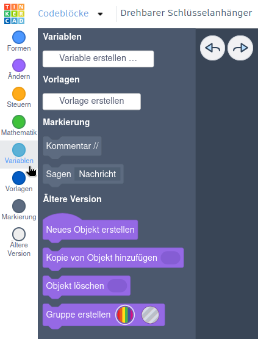

    2. Klicke auf den Knopf **Variable erstellen …**.

    3. Gib als Namen **„Anzahl der Ringe“** ein und klicke auf **Erstellen**.

        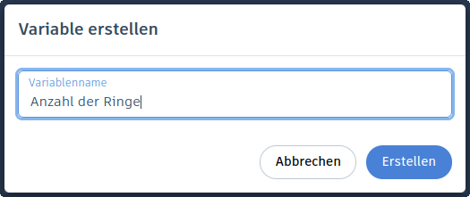

    4. Für jede Variable entstehen neue Blöcke, die wir später beim Erstellen des Schlüsselanhängers benutzen.

        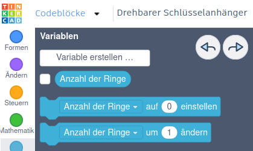

    5. Ziehe den Block **Anzahl der Ringe auf 0 einstellen** auf die rechte Fläche. Ändere die Zahl im Block von 0 auf **3**.

        

    6. Erzeuge nun die restlichen Variablen wie im folgenden Bild. Die weißen Kommentare kannst du weglassen. Sie dienen nur als Erklärung der einzelnen Variablen und haben keinen weiteren Einfluss.

        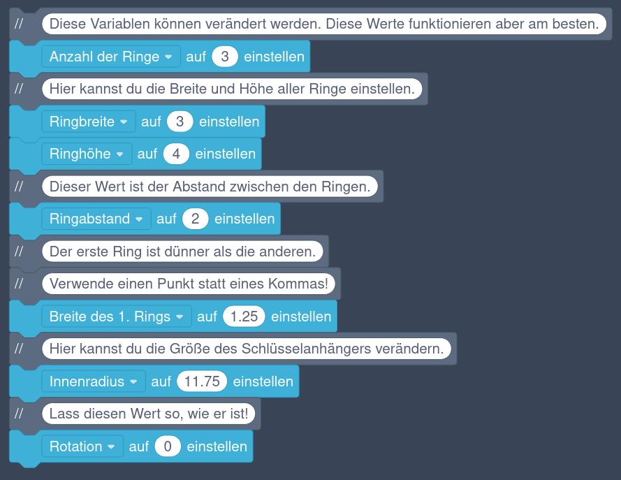
    {style="list-style: lower-alpha;"}

3. Mit diesen Variablen können wir jetzt die Werte weiterer Variablen berechnen. Diese Berechnungen vereinfachen später die Beschreibung des Schlüsselanhängers.

    1. Erzeuge eine neue Variable und nenne sie **„Differenz der Ringgrößen“**.

    2. Ziehe den Block **Anzahl der Ringe auf 0 einstellen** auf die rechte Fläche. Ändere die Variable zu **„Differenz der Ringgrößen“**.

    3. Ziehe einen grünen **„0 + 0“-Block** an die Stelle, wo der **Wert** steht.
        

        - 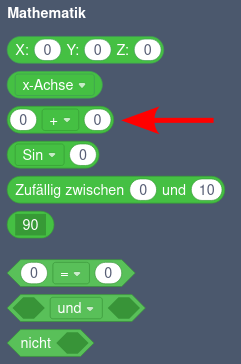
        - 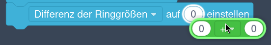

        

    4. Ersetze die erste 0 mit einem blauen **„Ringabstand“-Block**.

    5. Ersetze die zweite 0 mit einem blauen **„Ringbreite“-Block**.

        

    6. Erzeuge jetzt die restlichen Berechnungen wie im folgenden Bild.

        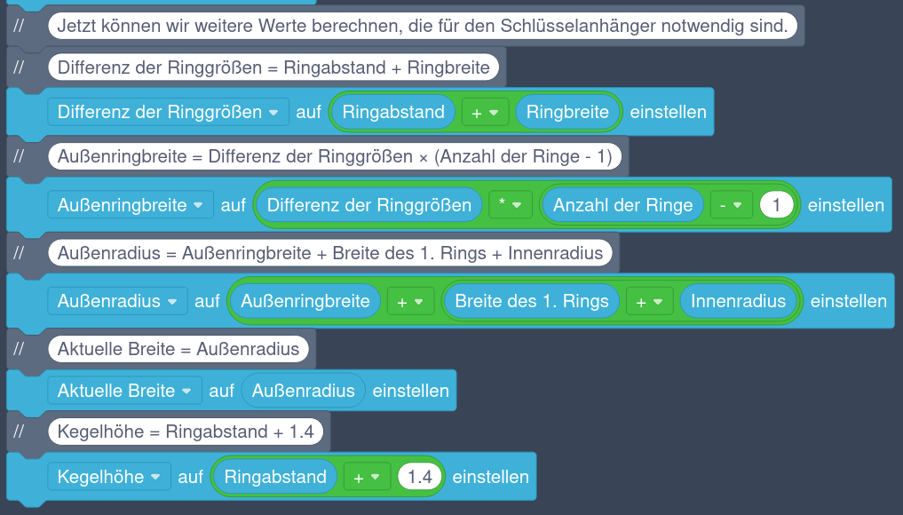
    {style="list-style: lower-alpha;"}

4. Als nächstes Erzeugen wir die Kegel, die als Drehpunkte dienen und über die sich die einzelnen Ringe berühren.

    1. Ziehe einen violetten Block **„Neues Objekt erstellen“** (in der Liste ganz unten) auf die Fläche und ändere den Namen auf **„Kegel“**.

    2. Füge aus der Gruppe **Formen** einen blauen Block **Kegel** hinzu.

        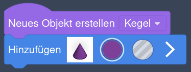

    3. Klicke auf den weißen Pfeil und ändere die folgenden Eigenschaften des Kegels:
        - „Oberer Radius“ auf **0.3**,
        - „Radius unten" auf die Berechnung **„Ringhöhe / 2“** und
        - „H“ auf **„Kegelhöhe“**.

        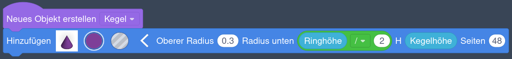

    4. Füge einen violetten **„Verschieben“-Block** hinzu und setze den Wert für **Z** auf die Berechnung **„Kegelhöhe/2“**.

        

    5. Füge einen **Zylinder** mit dem Radius **„Kegelhöhe/2“** und der Höhe **1** hinzu.

        

    6. Füge einen **„Verschieben“-Block** mit einem **Z-Wert** von **-0.5** hinzu.

        

    7. Füge einen violetten **„Gruppe erstellen“-Block** (in der Liste ganz unten) hinzu. Du kannst die Farbe frei wählen.
        >[!INFO]
        > Das Einfügen dieses Blockes bewirkt das Gleiche, wie wenn du in Tinkercad mehrere Objekte auswählst und auf „Vereinigungsgruppe“ klickst: Die Objekte werden kombiniert und es bleibt ein einzelnes Objekt übrig.

    8. Füge einen violetten **„Herumdrehen“-Block** hinzu. Stelle eine Drehung um die **x-Achse** um **‑90** Grad ein. Verwende als **Drehpunkt** einen grünen **„X:0 Y:0 Z:0“-Block**.

    9. Die komplette Beschreibung des Kegels sollte wie im folgenden Bild aussehen:

        

    10. Klicke unten auf den Play-Knopf  und prüfe das Ergebnis. Über den Knopf rechts daneben werden die Blöcke schneller abgearbeitet. Alle Blöcke werden von oben nach unten verarbeitet. Rechts oben siehst du das Ergebnis. Es sollte so wie im folgenden Bild aussehen:

        
    {style="list-style: lower-alpha;"}

5. Jetzt können wir die kegelförmigen Vertiefungen erzeugen, in denen sich die eben erstellten Kegel drehen. Dazu erstellen wir ein neues Objekt **„Loch“**.

    1. Ziehe einen violetten Block **„Neues Objekt erstellen“** (in der Liste ganz unten) auf die Fläche und ändere den Namen auf **„Loch“**.

    2. Füge aus der Gruppe **Formen** einen blauen Block **Kegel** hinzu.

    3. Klicke auf den weißen Pfeil und ändere die folgenden Eigenschaften des Kegels:
        - „Oberer Radius“ auf **0.35**,
        - „Radius unten" auf die Berechnung **„(Ringhöhe / 2) + 0.75“** und
        - „H“ auf die Berechnung **„Kegelhöhe + 0.1“**.

        

    4. Füge einen violetten **„Verschieben“-Block** hinzu und setze den Wert für **Z** auf die Berechnung **„(Kegelhöhe + 0.2) / 2“**.

    5. Füge einen violetten **„Gruppe erstellen“-Block** (in der Liste ganz unten) hinzu. Setze den Typ auf **Bohrung**.

    6. Füge einen violetten **„Herumdrehen“-Block** hinzu. Stelle eine Drehung um die **x-Achse** um **‑90** Grad ein. Verwende als **Drehpunkt** einen grünen **„X:0 Y:0 Z:0“-Block**.

    7. Die komplette Beschreibung sollte wie im folgenden Bild aussehen:

        
    {style="list-style: lower-alpha;"}

6. Nach dem Ausführen sollte das Ergebnis wie im folgenden Bild aussehen:

    

7. Als Nächstes erzeugen wir den äußeren Ring. Wir erstellen ein neues Objekt **„Schlüsselanhänger“** mit den folgenden Blöcken:

    

    Diese Blöcke erzeugen den äußeren Ring und zwei Kopien des Objekts **„Loch“**. Diese Löcher werden auf gegenüberliegenden Seiten des Rings platziert. Durch das Gruppieren entsteht ein Ring mit zwei kegelförmigen Löchern. Prüfe wieder das Ergebnis und vergleiche es mit dem folgenden Bild.

    

8. Jetzt können wir die mittleren Ringe erzeugen. Das sind die Ringe, die zwischen dem inneren und dem äußeren Ring liegen. Ihre Anzahl hängt von der Variablen **„Anzahl der Ringe“** ab. Da wir zu Beginn die Anzahl der Ringe auf drei gesetzt haben, gibt es nur *einen* mittleren Ring. Jeder mittlere Ring hat außen zwei Kegel, die genau in den Löchern des nächstgrößeren Rings sitzen.

    Erstelle dazu die folgenden Blöcke direkt unter dem letzten violetten **„Gruppe erstellen“-Block**.

    

    Prüfe wieder das Ergebnis. Es müsste wie im folgenden Bild aussehen.

    

9. Die mittleren Ringe haben noch keine Löcher. Diese werden mit den folgenden Blöcken eingefügt.
    

    Die Löcher und die Kegel der mittleren Ringe sind um eine Viertelumdrehung (90°) zueinander versetzt. Dadurch können die Ringe später in alle Richtungen verdreht werden.

    Das Ergebnis ist wieder im folgenden Bild dargestellt.

    

    Damit sind die mittleren Ringe fertig! Du kannst die Anzahl der Ringe ändern, um eine beliebige Zahl mittlerer Ringe zu erzeugen. Die Anzahl sollte aber nicht zu groß sein, da Tinkercad die Gesamtgröße des generierten Objekts beschränkt.

    Setze die Anzahl der Ringe auf **18** und probier es aus!

10. Zuletzt wird der innere Ring erzeugt. Dieser soll nur zwei Kegel aber keine Löcher besitzen. Später kannst du ein Logo oder Text in den inneren Ring einfügen. Füge dazu die folgenden Blöcke unter den letzten orangefarbenen **„Anzahl Ausführen“-Block** ein.
    

    Im folgenden Bild siehst du wieder, wie es aussehen sollte.

    

11. **Wir sind fast fertig!** Es muss nur noch ein wenig aufgeräumt werden, bevor du den Schlüsselanhänger exportieren kannst. Füge die letzten drei Blöcke am Ende ein.

    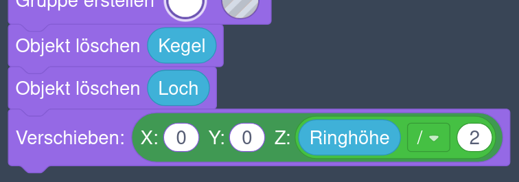

    Damit löschen wir die Vorlagen für die Kegel und Löcher und verschieben den Schlüsselanhänger, sodass er auf der Arbeitsfläche aufliegt.

    Das Ergebnis sollte wie im folgenden Bild aussehen.

    

12. Klicke oben rechts auf **„Freigeben“** und dann auf **„3D-Form“**.

    Gib als Namen z.&nbsp;B. **„Schlüsselanhänger“** ein und klicke auf **„Form speichern“**.

13. Erstelle in Tinkercad einen neuen 3D-Entwurf. Klicke rechts auf **„Einfache Formen“** und wähle die Bibliothek **„Ihre Kreationen“** aus. Du solltest jetzt das Symbol deines Schlüsselanhängers sehen.

    Klicke das Symbol an und platziere den Anhänger auf der Arbeitsfläche.

14. Überlege, was im inneren Ring zu sehen sein soll. Du könntest z.&nbsp;B. eine SVG-Datei herunterladen und einfügen, Text generieren, oder mit dem „Scribble“-Werkzeug (in der Bibliothek „Einfache Formen“) eine eigene Form erzeugen. 

    Du kannst auch auf https://www.thingiverse.com nach passenden 3D-Objekten Ausschau halten.

    SVG-Dateien kannst du wieder auf den Internetseiten https://freesvg.org und https://www.svgrepo.com suchen. Verwende englische Suchbegriffe, um bessere Ergebnisse zu erhalten.

    Es gibt auch Internetseiten, auf denen du SVG-Dateien verändern kannst. Ein Beispiel ist die Seite https://svgeditoronline.com/editor/.

    Wichtig ist, dass das resultierende Objekt genauso hoch ist, wie die Ringe. Das sind in unserem Fall genau **4&nbsp;mm**.

    Achte auch auf die **Ausrichtung** und **zentriere** das Objekt im Schlüsselanhänger. Es sollte so groß sein, dass es den inneren Ring genügend überlappt.

    Das Ergebnis könnte z.&nbsp;B. wie im folgenden Bild aussehen.

    

15. Jetzt fehlt nur noch ein Ring, um den Anhänger am Schlüssel befestigen zu können.

    1. Füge ein Rohr aus der Bibliothek „Einfache Formen“ hinzu.

        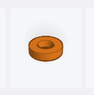

    2. Setze die Wandstärke auf **1.5** und den Radius auf **5**.

        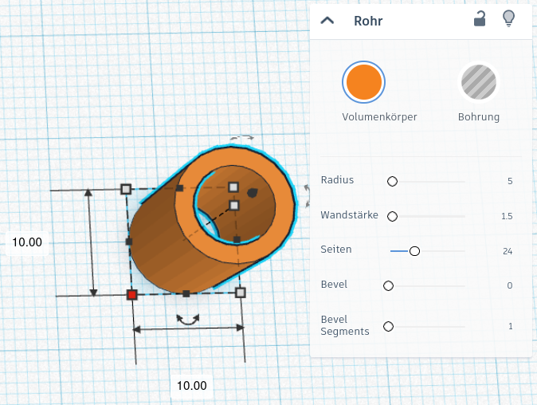

    3. Füge einen Quader ein. Setze die Länge und Breite auf **10&nbsp;mm** und schalte auf **„Bohrung“** um. Rotiere den Quader **45°** um die (senkrechte) z-Achse.

        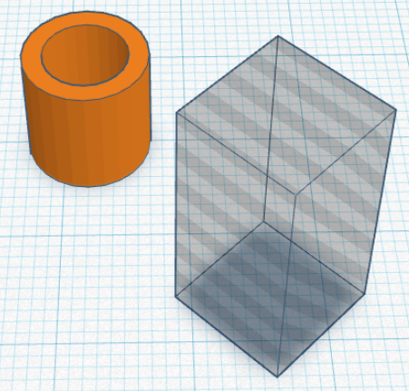

    4. Zentriere den Ring (also das Rohr) und den Quader. Verschiebe den Quader dann so weit nach unten, bis er nur noch den halben Ring überlappt, so wie im folgenden Bild.

        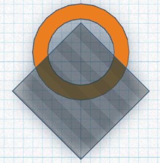

    5. Vereinige den Ring und den Quader. Ändere die Höhe des resultierenden Objekts auf **4&nbsp;mm**.

        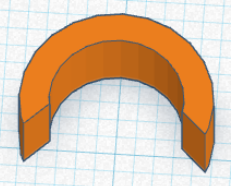

    6. Zentriere den eben erstellten Ring und den Schlüsselanhänger. Verschiebe den Ring so weit nach oben, bis er nur noch den äußeren Ring des Schlüsselanhängers überlappt.

        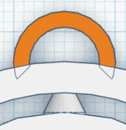

    7. Vereinige zum Schluss alles.

        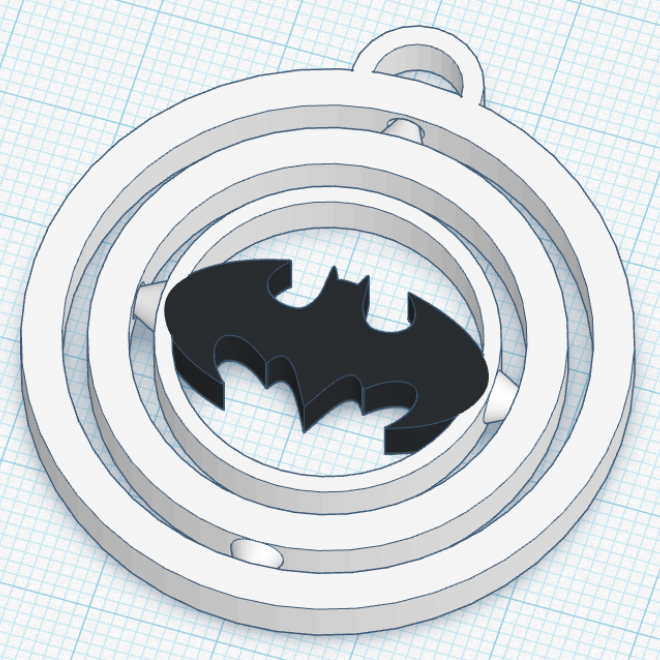
    {style="list-style: lower-alpha;"}

> [!TIP]
> Damit ist dein drehbarer Schlüsselanhänger fertig.

{}

