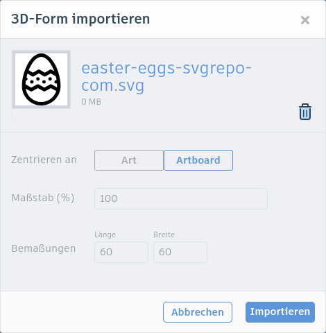
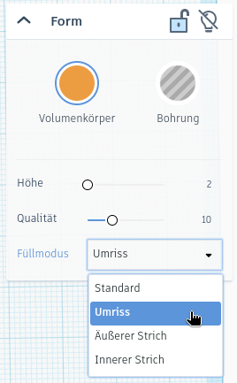
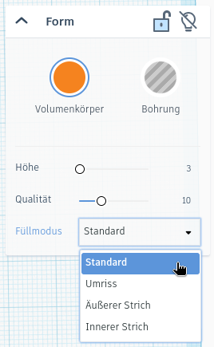

# Drei-Farb-Ei



Heute wollen wir ein dreifarbiges Osterei erstellen. Damit es leichter zu drucken ist, besteht es unterschiedlich hohen Elementen: Einer Grundplatte mit einer Höhe von 2&nbsp;mm, welche die Grundfarbe festlegt und weiteren Mustern oder Texten, die 3 oder 4&nbsp;mm hoch sind, je nachdem welche Farbe sie bekommen sollen.

Das funktioniert so ähnlich, wie wenn du aus buntem Papier Muster ausschneidest und sie passend übereinander legst. Beim Drucken kann in bestimmten Höhen (nämlich bei 2&nbsp;mm, 3&nbsp;mm und 4&nsbp;mm) die Filamentfarbe gewechselt werden, sodass ein dreifarbiges Ei entsteht, so wie im folgenden Bild.

{}

1. Zuerst benötigen wir eine passende Vektorgrafik. Gehe zu https://www.svgrepo.com und suche nach „Easter“ (Englisch für „Ostern“). Suche dir eine passende Grafik aus und lade die SVG-Datei herunter.

    

2. Öffne Tinkercad und erstelle einen neuen 3D-Entwurf. Importiere die SVG-Datei. Setze im folgenden Fenster bei der Bemaßung den **größeren der beiden Werte** (also die Länge *oder* die Breite) auf **60**. Oft sind beide Werte gleich.

    

3. Wähle das importierte Objekt aus und klicke oben rechts auf **Umriss**. Setze die **Höhe** auf **2&nbsp;mm**.

    

4. **Dupliziere** das Ei. Setze danach den Füllmodus auf **Standard** und die **Höhe** auf **3&nbsp;mm**. Ändere außerdem die **Farbe**.

    

5. Nun kannst z.&nbsp;B. noch Text oder weitere Formen hinzufügen. Setze die **Höhe** dieser Elemente auf **4&nbsp;mm**, damit sie in einer dritten Farbe gedruckt werden!

6. Zum Schluss kannst du noch ein Loch zum Aufhängen hinzufügen.

7. Erstelle weitere Drei-Farb-Eier auf die gleiche Weise, aber mit anderen Grafiken!

{}

