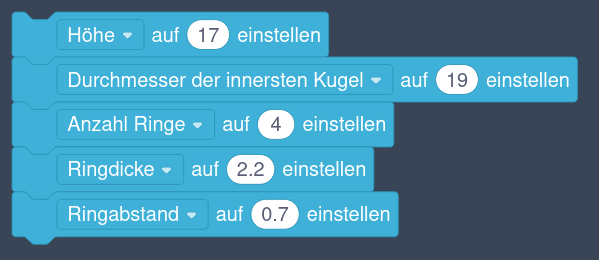
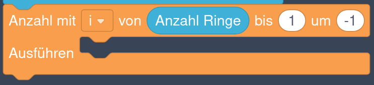

# Gyro



Heute wollen wir ein kleines Spielzeug entwerfen, das aus mehreren Kugelschalen besteht, die sich um eine innere Kugel drehen können. Es wird in einem Stück gedruckt und ist sofort beweglich.

## Erstellen der Variablen

{}

1. Öffne Tinkercad und erstelle ein neues Projekt auf Basis von **Codeblöcken**.

    

2. Genau wie beim [drehbaren Schlüsselanhänger](../09-spinning-key-fob/) erstellen wir zuerst einige Variablen. Dafür verwenden wir im Abschnitt *Variablen* den Knopf **Variable erstellen ...**. Die folgende Tabelle zeigt ihre **Namen** und ihren **Wert**:

    

    | Name                            | Wert                      |
    |---------------------------------|---------------------------|
    | Höhe                            | 17                        |
    | Durchmesser der innersten Kugel | 19                        |
    | Anzahl Ringe                    | 4                         |
    | Ringdicke                       | 2.2                       |
    | Ringabstand                     | 0.7                       |
    | Aktueller Kugelradius           | keine Zuweisung notwendig |
    
    

    Achte darauf, dass du jede Variable nur einmal erstellst! Durch unterschiedliche Schreibweisen können sonst leicht doppelte Variablen entstehen. Das Ergebnis sollte so wie im folgenden Bild aussehen:

    

{}

## Erzeugung der Kugelschalen

Jede Kugelschale entsteht durch das Abziehen einer kleineren von einer größeren Kugel. Dadurch wird alles im Inneren der größeren Kugel gelöscht. Aus diesem Grund müssen wir die Kugelschalen von **außen** nach **innen** erstellen, damit nicht die kleineren Kugelschalen im Inneren einer größeren Kugelschale gelöscht werden.

{}

1. Erzeuge eine Schleife „Anzahl mit *i* von **Anzahl Ringe** bis 1 um -1“. Diese Schleife zählt von der 4 (der Anzahl der Ringe) rückwärts bis 1. Das heißt, beim ersten Durchgang ist *i*&nbsp;=&nbsp;4, beim zweiten *i*&nbsp;=&nbsp;3, beim dritten *i*&nbsp;=&nbsp;2 und beim letzten Durchgang ist *i*&nbsp;=&nbsp;1.

    

2. In dieser Schleife setzen wir zuerst den Wert der Variablen **Aktueller Kugelradius** auf:

    

    **(Durchmesser der innersten Kugel / 2) + *i* ⋅ (Ringdicke + Ringabstand)**

    

    

3. Nun können wir die Kugelschale erzeugen, indem wir eine um die Ringdicke kleinere Kugel von einer größeren Kugel abziehen. Achte darauf, die Anzahl der Schritte auf **36** zu erhöhen.

    

{}

## Aufschneiden der Kugelschalen

{}

Die Kugelschalen sind damit alle fertig, auch wenn momentan nur die äußerste Kugelschale zu sehen ist. Deshalb schneiden wir jetzt die Kugelschalen oben und unten auf.

1. Im Inneren der eben erzeugten Kugelschalen soll sich eine Kugel befinden. Füge daher eine Kugel mit dem Radius **Durchmesser der innersten Kugel / 2** hinzu. Setze wieder die Anzahl der Schritte auf **36**.

2. Füge einen **Quader** mit einer **Breite von 100**, einer **Länge von 100** und einer **Höhe von 40** hinzu. Definiere den Quader als **Bohrung**.

3. Füge einen violetten Block **X-axis min nach 0.0 verschieben** hinzu. Es ist der **dritte** Block im Abschnitt **Ändern**. Mit diesem Block können wir den Quader entlang einer bestimmten Achse verschieben. Wir wollen den Quader entlang der **Z-Achse** (also nach oben) so verschieben, dass seine untere Fläche bei **Höhe / 2** liegt. Die untere Fläche wird dabei über die Option **min** ausgewählt.
    
    

4. Als nächstes erzeugen wir eine Kopie des Quaders. Füge dazu einen violetten Block **Kop.** (steht für Kopieren) ein.

5. Diese Kopie wird mit einem zweiten Block **X-axis min nach 0.0 verschieben** entgegen der Richtung der Z-Achse, also nach unten, verschoben. Diesmal wollen wir, dass die *obere* Fläche bei **‑Höhe&nbsp;/&nbsp;2** liegt. Die obere Fläche wird dabei über die Option **max** ausgewählt.

    Durch die Verschiebung der beiden Quader bleiben zwischen ihnen Kugelschalen-Ringe mit der korrekten **Höhe** übrig.

6. Zum Schluss verwenden wir den Block **Gruppe erstellen** um alles zu vereinigen. Dadurch werden die Kugelschalen wie gewünscht oben und unten aufgeschnitten.

    Das folgende Bild zeigt die einzelnen Befehle:

    

{}

## Gesamter Ablauf


