# Durcheinander



Heute erstellen wir ein kleines Spielzeug aus zwei Teilen, die wie eine Schraube und Mutter ineinander gedreht werden können.

## Erstellen der Schraube

Ausgangspunkt für die Schraube ist eine **Skizze**. Das ist genau wie eine Zeichnung auf einem Blatt Papier. Diese Skizze werden wir dann aus dem Papier heraus in die Höhe ziehen (extrudieren) und dabei drehen. Das funktioniert so ähnlich, wie die Herstellung von Spirelli, wo Nudelteig durch eine passende Öffnung gedrückt wird:

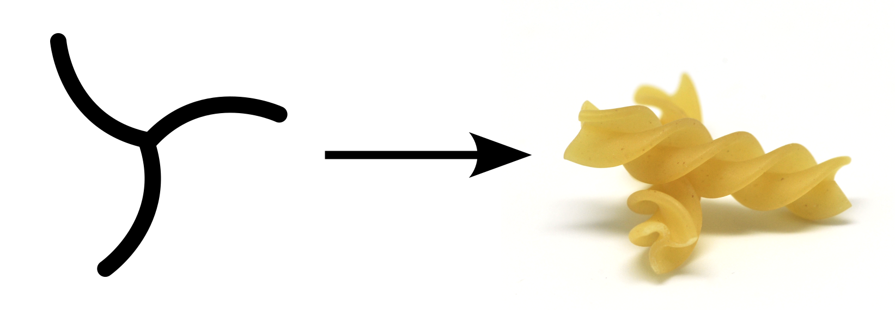

{}

1. Öffne Tinkercad und erstelle einen neuen **3D-Entwurf**.

2. Erstelle eine neue **Skizze**, indem du die Füllfeder aus der Liste der Formen auf der rechten Seite auswählst.

    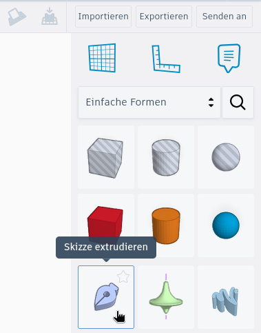

3. Es öffnet sich automatisch eine neue Ansicht. Klicke oben in der Mitte auf **Funktionen in der Skizze** und schaue dir die Videos zu den einzelnen Werkzeugen an. 

    

4. Der Querschnitt der Schraube soll wie im folgenden Bild aussehen. Du kannst aber auch andere Formen ausprobieren! Vielleicht soll deine Schraube wie eine Spirelli aussehen?

    

5. Beim Öffnen einer Skizze ist am linken Rand das Werkzeug zum **Zeichnen von geraden Linien** aktiv (siehe Bild).

    

    1. Zeichne einige Linien um zu lernen, wie es funktioniert. Zum Fertigstellen einer Linie, klicke auf den **grünen Haken** am linken Rand (siehe Bild) oder drücke die **Escape-Taste (Esc)**.

        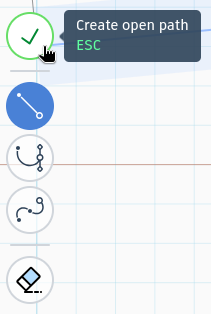

    2. Wähle danach das zweite Werkzeug zum **Zeichnen von Bézierkurven**. Hier musst du beim Klicken die Maustaste gedrückt halten, damit Kurven entstehen.

    3. Teste nun das dritte Werkzeug zum **Zeichnen glatter Kurven**.

    4. Nachdem du alles ausprobiert hast, lösche alle Linien.
    {style="list-style: lower-alpha;"}

6. Wähle das Werkzeug zum **Zeichnen gerader Linien** und erstelle eine horizontale Linie mit einer Länge von **14&nbsp;mm**.

    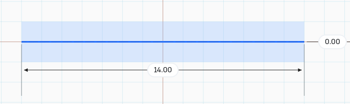

7. Wähle die Linie per Mausklick aus und klicke unten in der Mitte aus **Strickeinstellungen**.

    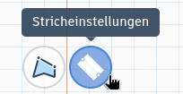

8. Setze die Breite auf **5** und aktiviere **Enden abschließen: Rund**. Das ist so, als würdest du die Linie mit einem **runden Filzstift** mit einem Durchmesser von **5&nbsp;mm** nachzeichnen.

    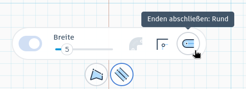

9. Damit sollte die erste Linie wie im folgenden Bild aussehen:

    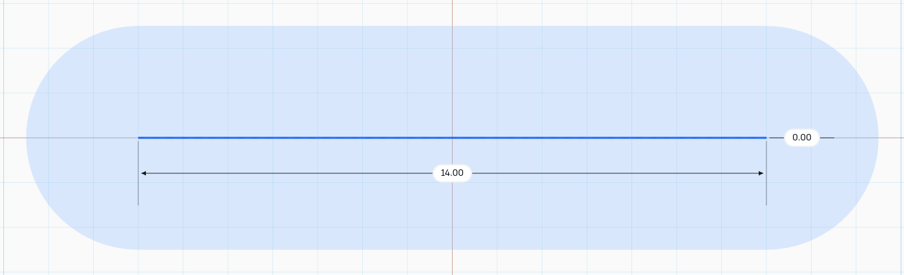

10. Erzeuge auf dieselbe Weise eine zweite Linie, die senkrecht durch die Mitte der erste Linie verläuft. Die Einstellungen sollen identisch zur ersten Linie sein.

    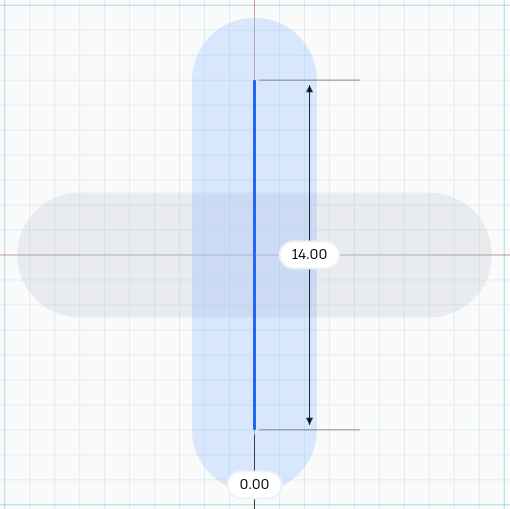

11. Damit ist die Skizze fertig! Klicke oben rechts auf **Skizze fertigstellen**. Die Skizze wird nun automatisch in die Höhe gezogen (extrudiert), so dass ein 3D-Objekt entsteht.

12. Führe die folgenden Schritte im Formular mit den Einstellungen für das Extrudieren aus:

    1. Setze die **Höhe** auf **40**.

    2. Setze **Verdrehen** auf **180**. Dadurch wird die Skizze während des Extrudierens um eine halbe Umdrehung (180°) gedreht.

    3. Wähle als **Verdrehungsmodus** die Option **Glatt**.

        
    {style="list-style: lower-alpha;"}

13. Damit ist der Grundkörper für die Schraube fertig. Das Ergebnis sollte wie im folgenden Bild aussehen:

    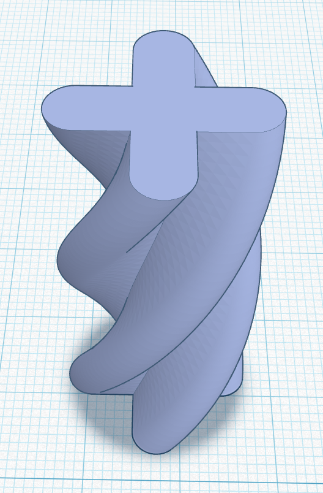
    
{}

## Erstellen des Lochs für das äußere Teil

{}

1. **Dupliziere** die eben erstellte Schraube.

2. Per **Doppelklick** auf die Kopie öffnet sich wieder die zugehörige Skizze.

3. Ändere die Breite **beider Striche** auf **5.5**. Dadurch wird das Loch in der Mutter später etwas größer als die Schraube und beides gleitet leicht durcheinander.

    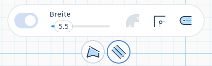

4. Damit ist die Skizze für das Loch im äußeren Teil schon fertig! Klicke wieder oben rechts auf **Skizze fertigstellen**.

5. Setze die Form auf **Bohrung**.

## Anpassen der äußeren Form

Nun sind die Schraube und das zu ihr passende Loch (Gewinde) fertig. Im nächsten Schritt können wir die äußere Form festlegen. In dieser Anleitung verwenden wir einen sogenannten Paraboloid, du kannst aber auch andere Formen verwenden, wie z.&nbsp;B. Quader oder Zylinder.

1. Erzeuge einen **Paraboloid**.

    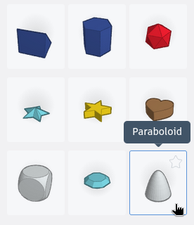

2. Setze seine Breite *und* Länge auf **25&nbsp;mm** und seine Höhe auf **40&nbsp;mm**.

3. **Dupliziere** den Paraboloid. Wir benötigen ihn einmal für das äußere und einmal für das innere Teil.

4. **Zentriere** die eben erstellte Bohrung im Paraboloid und **vereinige** beides. Das Ergebnis sollte wie im folgenden Bild aussehen:

    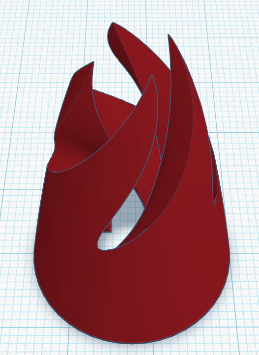

5. Nun muss noch das innere Teil, also die Schraube, angepasst werden.

6. Erzeuge einen Quader mit einer Breite *und* Länge von **30&nbsp;mm** und einer Höhe von **50&nbsp;mm**.

7. Setze den verbleibenden Paraboloiden auf **Bohrung**.

8. **Zentriere** den Paraboloiden im Quader und **vereinige** beides.

9. Setze das resultierende Objekt auf **Bohrung**.

    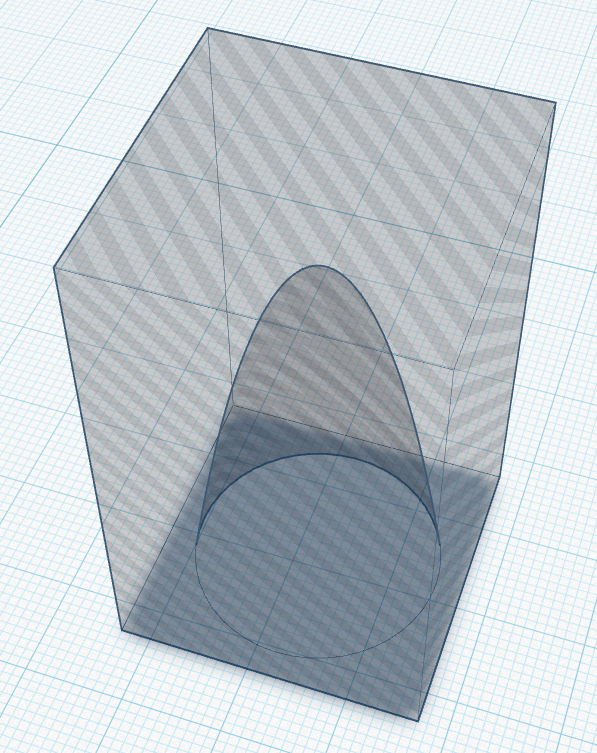

10. **Zentriere** die Schraube in dieser Bohrung und **vereinige** beides. Das Ergebnis sollte wie folgt aussehen:

    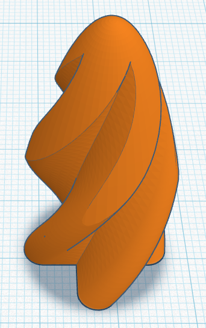

> [!TIP]
> Herzlichen Glückwunsch, damit hast du es geschafft dein eigenes *Durcheinander* zu konstruieren!
{}

